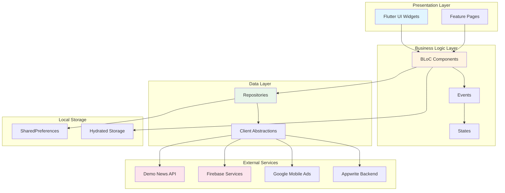
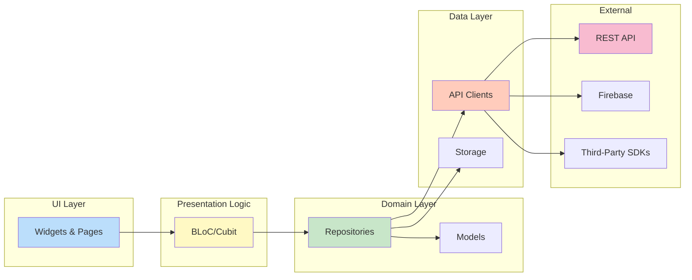
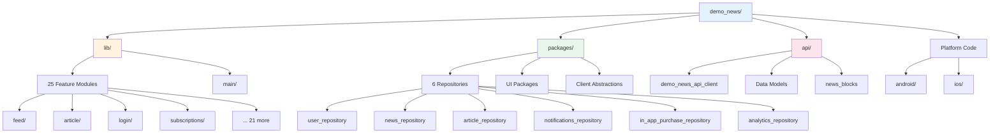
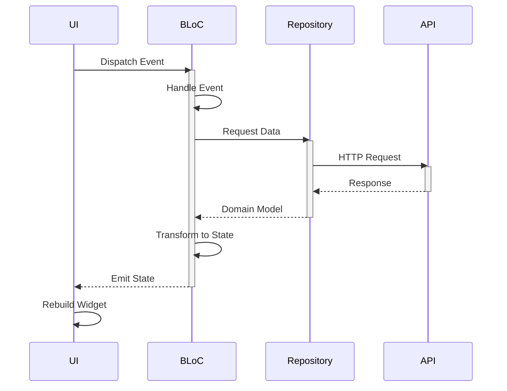
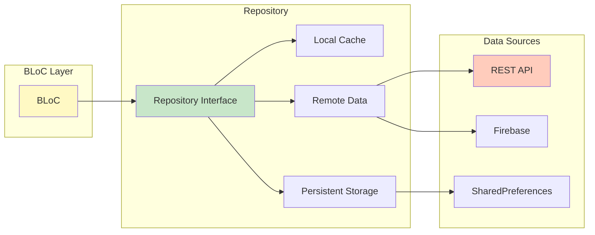
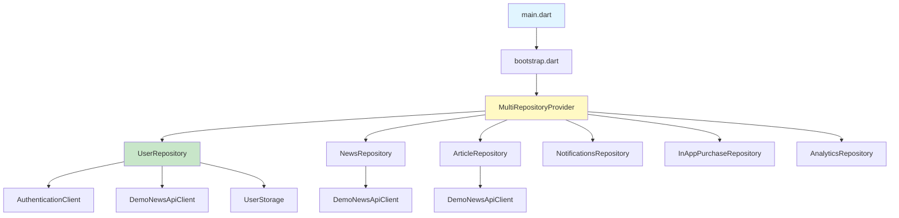
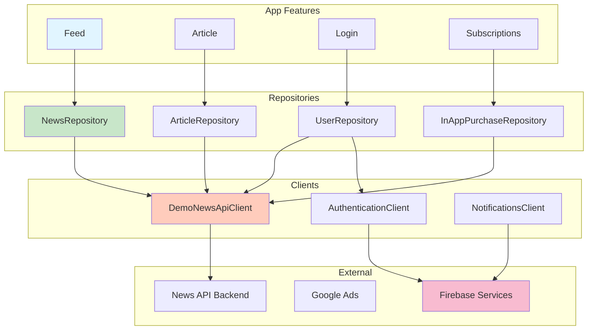
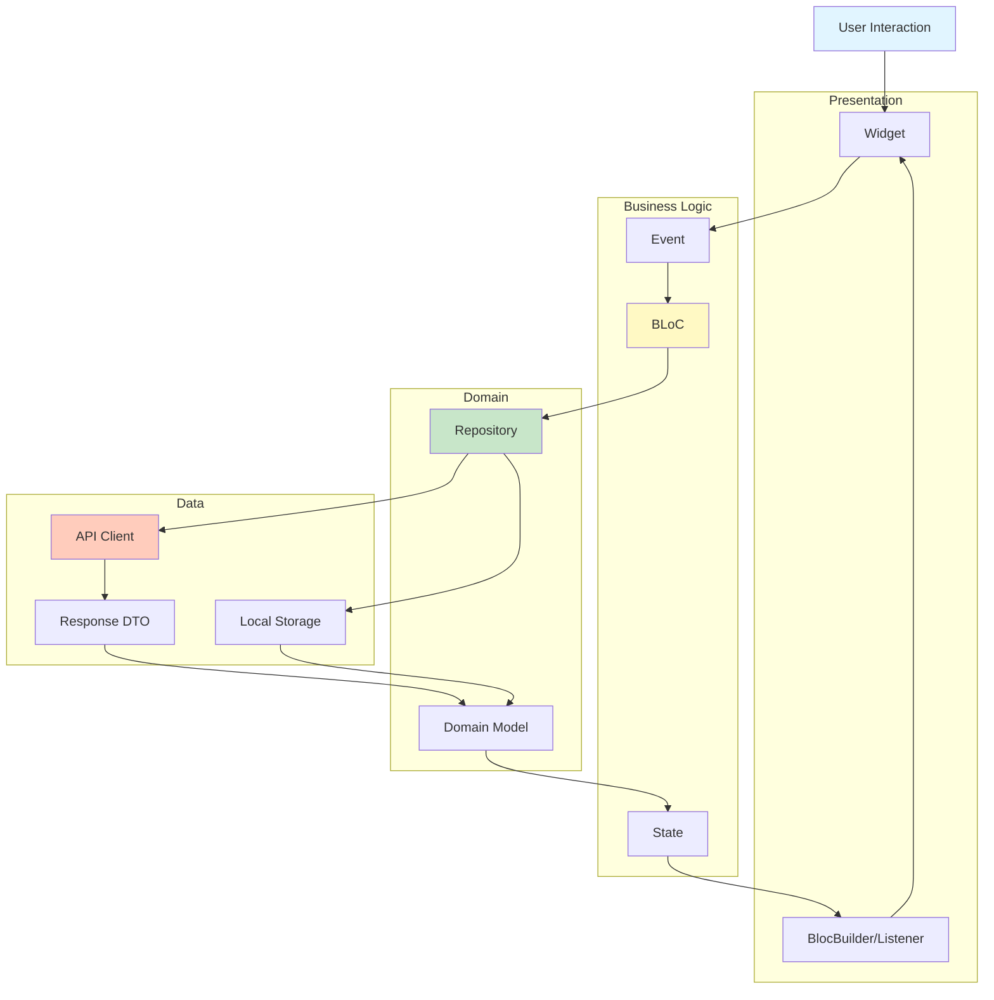

# Flutter News App - Architecture Overview

## Table of Contents
- [Introduction](#introduction)
- [High-Level Architecture](#high-level-architecture)
- [Project Structure](#project-structure)
- [Architecture Patterns](#architecture-patterns)
- [Technology Stack](#technology-stack)
- [Module Dependencies](#module-dependencies)

## Introduction

This is a production-grade Flutter news application built with clean architecture principles. The app provides news content delivery, multi-provider authentication, subscription management, and ad monetization.

**Key Characteristics:**
- Multi-package modular architecture
- BLoC pattern for state management
- Repository pattern for data abstraction
- Clean separation of concerns
- Platform support: iOS & Android

## High-Level Architecture



## Clean Architecture Layers



## Project Structure



## Directory Organization

```
demo_news/
├── lib/                          # Main application code
│   ├── ads/                      # Ad management
│   ├── analytics/                # Analytics tracking
│   ├── app/                      # App-level BLoC
│   ├── article/                  # Article viewing
│   ├── categories/               # Category management
│   ├── feed/                     # News feed
│   ├── home/                     # Home navigation
│   ├── login/                    # Authentication
│   ├── main/                     # Entry points
│   ├── navigation/               # Navigation structure
│   ├── notification_preferences/ # Push notification settings
│   ├── onboarding/               # First-time UX
│   ├── search/                   # Search functionality
│   ├── subscriptions/            # In-app purchases
│   ├── theme_selector/           # Theme switching
│   └── user_profile/             # User profile
│
├── packages/                     # Shared packages (22 total)
│   ├── analytics_repository/     # Analytics abstraction
│   ├── article_repository/       # Article data
│   ├── authentication_client/    # Auth abstraction
│   ├── in_app_purchase_repository/ # IAP management
│   ├── news_repository/          # News data
│   ├── notifications_repository/ # Notification management
│   ├── user_repository/          # User data
│   ├── app_ui/                   # UI components
│   ├── news_blocks_ui/           # News content blocks
│   └── storage/                  # Storage abstraction
│
├── api/                          # Backend API layer
│   ├── lib/src/
│   │   ├── client/               # HTTP client
│   │   ├── models/               # Response DTOs
│   │   └── middleware/           # Request interceptors
│   └── packages/news_blocks/     # Content block types
│
├── android/                      # Android platform
├── ios/                          # iOS platform
└── test/                         # Unit & widget tests
```

## Architecture Patterns

### 1. BLoC Pattern (Business Logic Component)



**Key BLoCs in the App:**
- **AppBloc** - App-wide authentication state
- **FeedBloc** - News feed management
- **ArticleBloc** - Article viewing & tracking
- **LoginBloc** - Authentication flows
- **SubscriptionsBloc** - Purchase management
- **FullScreenAdsBloc** - Ad loading & display
- **CategoriesBloc** - Category management
- **SearchBloc** - Search functionality
- **NotificationPreferencesBloc** - Notification settings
- **NewsletterBloc** - Newsletter subscription
- **UserProfileBloc** - User profile management

### 2. Repository Pattern



**Repository Responsibilities:**
- Abstract data sources from business logic
- Handle data transformation (DTO → Domain Model)
- Implement caching strategies
- Manage error handling
- Provide stream-based APIs

### 3. Dependency Injection



## Technology Stack

### Core Framework
```yaml
Flutter: 3.24.2
Dart: >=3.5.0 <4.0.0
```

### State Management
- **bloc**: ^8.1.0 - Core BLoC library
- **flutter_bloc**: ^8.0.1 - Flutter widgets for BLoC
- **hydrated_bloc**: ^9.0.0 - Persistent state management
- **flow_builder**: ^0.0.7 - Navigation flow management

### Authentication
- **firebase_auth**: ^6.1.2 - Firebase authentication
- **google_sign_in** - Google OAuth
- **sign_in_with_apple** - Apple ID authentication
- **flutter_facebook_auth** - Facebook OAuth
- **twitter_login** - Twitter OAuth
- **appwrite**: 17.0.0 - Alternative backend (experimental)

### Networking
- **http** - HTTP client (via demo_news_api)
- Custom REST client implementation

### Analytics & Monitoring
- **firebase_analytics**: ^12.0.4 - Event tracking
- **firebase_crashlytics**: ^5.0.4 - Crash reporting
- **firebase_messaging**: ^16.0.4 - Push notifications

### Monetization
- **google_mobile_ads**: ^5.0.0 - Interstitial & rewarded ads
- **in_app_purchase** - Subscription purchases

### Storage
- **shared_preferences**: ^2.0.15 - Key-value storage
- **path_provider**: ^2.1.4 - File system paths

### UI Components
- **flutter_svg**: ^2.0.5 - SVG rendering
- **font_awesome_flutter**: ^10.1.0 - Icon library
- **visibility_detector**: ^0.4.0+2 - Visibility tracking

### Utilities
- **equatable**: ^2.0.3 - Value equality
- **collection**: ^1.16.0 - Collection utilities
- **intl**: ^0.19.0 - Internationalization
- **clock**: ^1.1.0 - Time manipulation

## Module Dependencies



## Data Flow Architecture



## Build Variants

### Development Build
```dart
// main_development.dart
- Base URL: http://localhost:8080
- Package: com.demo.news.dev
- Clears storage on startup
- Debug logging enabled
```

### Production Build
```dart
// main_production.dart
- Base URL: Production API
- Package: com.demo.news
- Persistent storage
- Error reporting enabled
```

## Key Design Principles

1. **Separation of Concerns**: Each layer has a single responsibility
2. **Dependency Inversion**: High-level modules don't depend on low-level modules
3. **Abstraction**: Repositories and clients provide abstract interfaces
4. **Immutability**: BLoC states are immutable using Equatable
5. **Reactive Programming**: Stream-based data flow throughout the app
6. **Testability**: Clear boundaries enable comprehensive unit testing
7. **Modularity**: Shared packages can be reused across projects

## Summary

This Flutter news app demonstrates enterprise-grade architecture with:
- **25 feature modules** for organized functionality
- **11 BLoCs + 1 Cubit** managing different aspects of the app
- **6 core repositories** abstracting data operations
- **22 shared packages** promoting code reuse
- **Clean architecture** with clear layer separation
- **Multi-provider authentication** supporting 5 login methods
- **Comprehensive state management** with persistence
- **Production-ready** monetization and analytics

The architecture enables scalability, maintainability, and testability while following Flutter and Dart best practices.
