# Network Layer & API Integration

## Table of Contents
- [Overview](#overview)
- [API Client Architecture](#api-client-architecture)
- [Network Call Flow](#network-call-flow)
- [API Endpoints](#api-endpoints)
- [Request/Response Models](#requestresponse-models)
- [Error Handling](#error-handling)
- [Token Management](#token-management)

## Overview

The app uses a custom REST API client (`DemoNewsApiClient`) to communicate with the backend. The network layer follows a token-based authentication pattern with automatic error handling and request/response transformation.

**Key Components:**
- **DemoNewsApiClient** - HTTP client wrapper
- **TokenProvider** - Dynamic token injection
- **Response Models** - Type-safe DTOs
- **Middleware** - Request/response interceptors
- **Error Types** - Custom exception hierarchy

## API Client Architecture

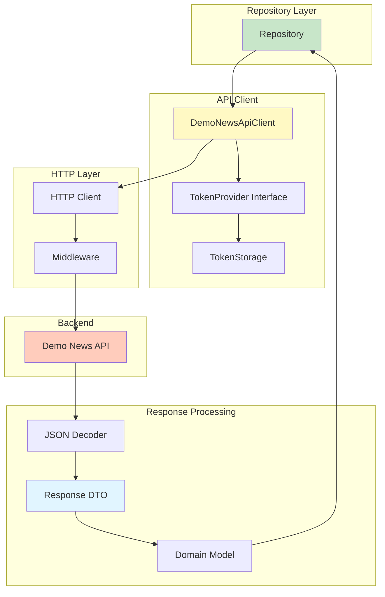

## DemoNewsApiClient Class Structure

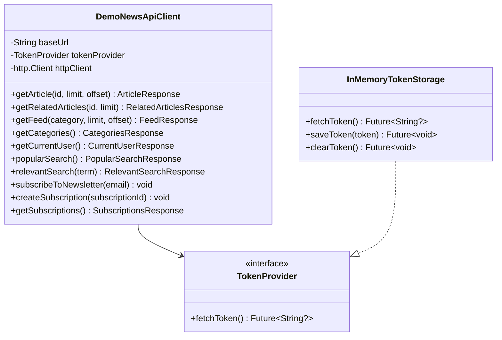

## Network Call Flow

### Complete Request Flow

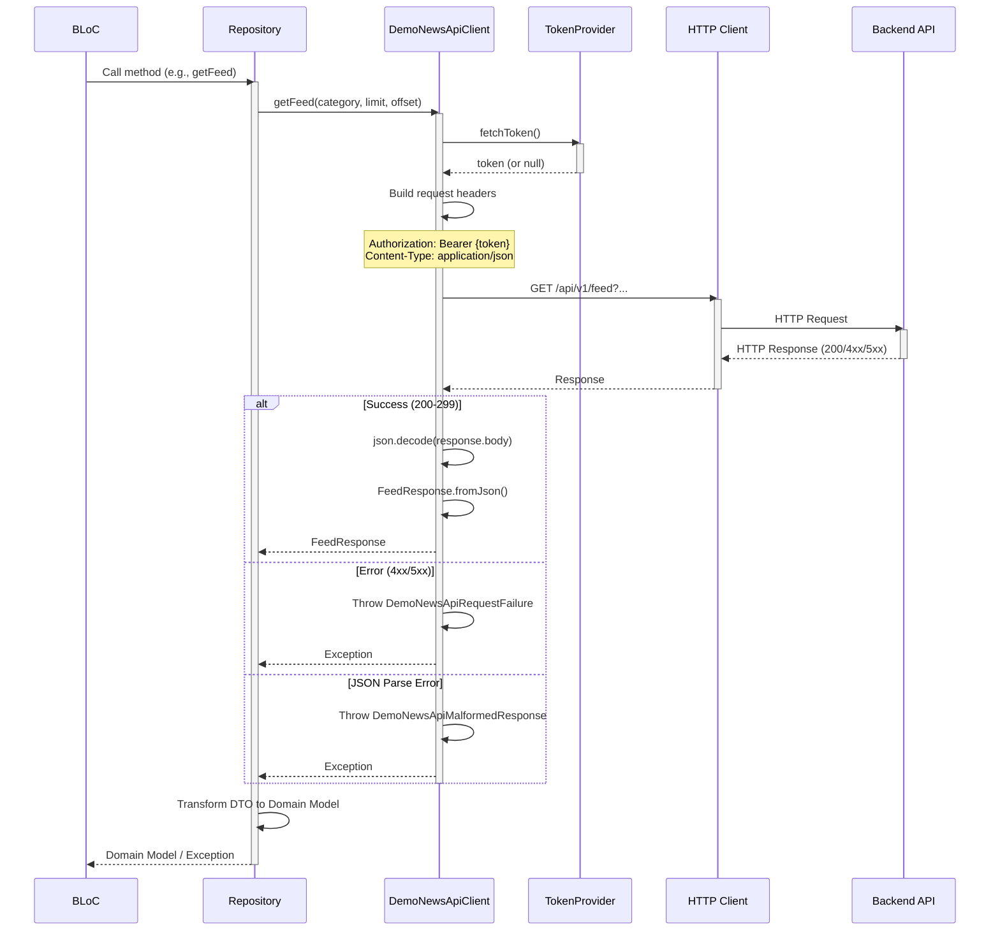

### Simplified Flow Example: Fetching News Feed

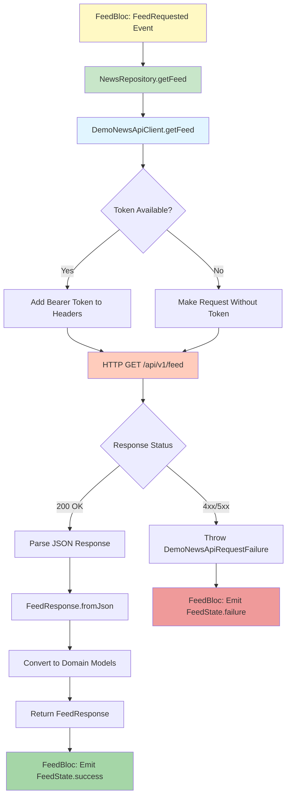

## API Endpoints

### Base Configuration

```dart
// Development
const String baseUrl = 'http://localhost:8080';

// Production
const String baseUrl = 'https://api.production.com'; // Actual URL
```

### Endpoint Reference

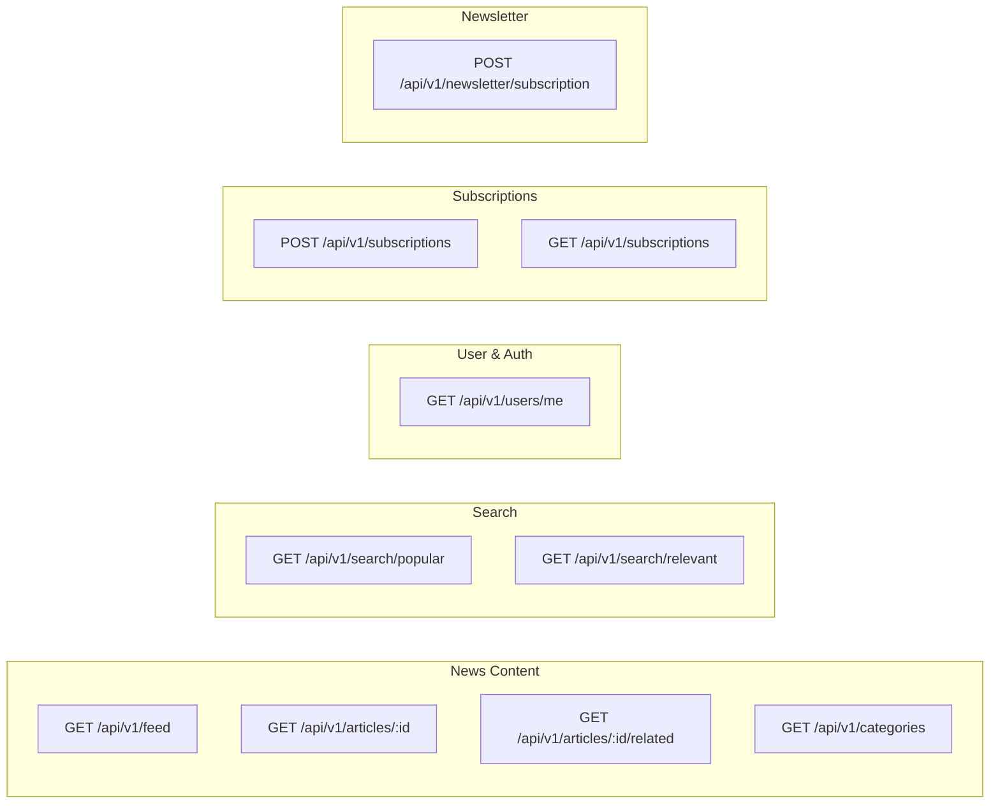

### Detailed Endpoints Table

| Method | Endpoint | Description | Auth Required | Query Parameters |
|--------|----------|-------------|---------------|------------------|
| GET | `/api/v1/feed` | Get paginated news feed | No | `category`, `limit`, `offset` |
| GET | `/api/v1/articles/{id}` | Get article content | No | `limit`, `offset` |
| GET | `/api/v1/articles/{id}/related` | Get related articles | No | `limit` |
| GET | `/api/v1/categories` | Get available categories | No | - |
| GET | `/api/v1/users/me` | Get current user + subscription | Yes | - |
| GET | `/api/v1/search/popular` | Get trending articles | No | - |
| GET | `/api/v1/search/relevant` | Search by term | No | `q` (query) |
| POST | `/api/v1/newsletter/subscription` | Subscribe to newsletter | No | Body: `{email}` |
| POST | `/api/v1/subscriptions` | Create subscription | Yes | Body: `{subscriptionId}` |
| GET | `/api/v1/subscriptions` | List subscriptions | Yes | - |

## Request/Response Models

### Data Model Architecture

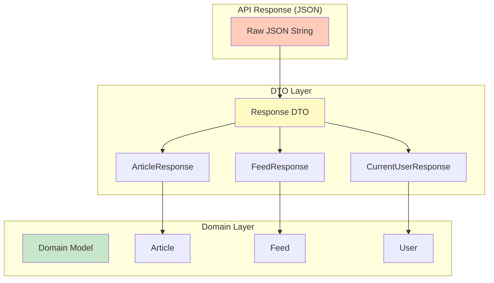

### Key Response Models

#### 1. FeedResponse
```dart
class FeedResponse {
  final List<Article> feed;
  final int totalCount;

  factory FeedResponse.fromJson(Map<String, dynamic> json) {
    return FeedResponse(
      feed: (json['feed'] as List)
          .map((item) => Article.fromJson(item))
          .toList(),
      totalCount: json['totalCount'] as int,
    );
  }
}
```

#### 2. ArticleResponse
```dart
class ArticleResponse {
  final String id;
  final String title;
  final List<NewsBlock> content;
  final String? url;
  final bool isPremium;

  factory ArticleResponse.fromJson(Map<String, dynamic> json);
}
```

#### 3. CurrentUserResponse
```dart
class CurrentUserResponse {
  final User user;
  final SubscriptionPlan subscription;

  factory CurrentUserResponse.fromJson(Map<String, dynamic> json);
}
```

### Response Transformation Flow

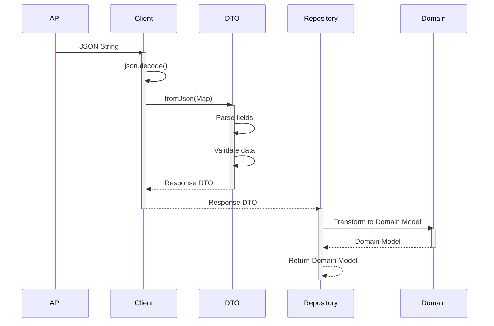

## Error Handling

### Exception Hierarchy

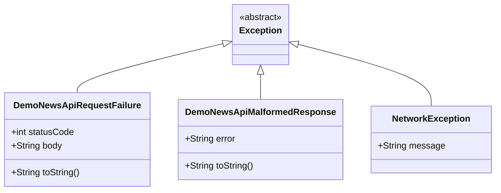

### Error Handling Flow

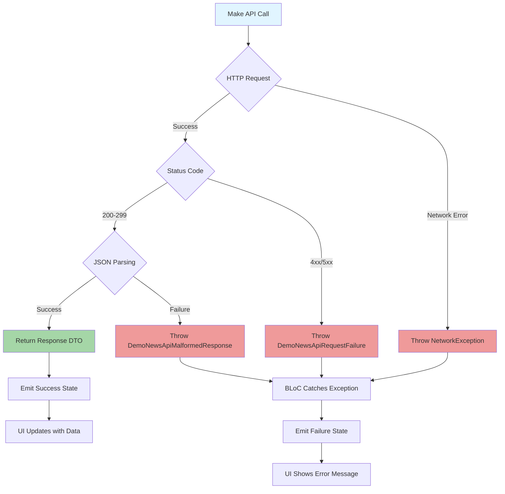

### Error Handling Example

```dart
try {
  final response = await apiClient.getFeed(
    category: Category.technology,
    limit: 10,
    offset: 0,
  );
  emit(state.copyWith(status: FeedStatus.success, feed: response.feed));
} on DemoNewsApiRequestFailure catch (error) {
  // HTTP error (4xx, 5xx)
  emit(state.copyWith(
    status: FeedStatus.failure,
    error: 'Request failed: ${error.statusCode}',
  ));
} on DemoNewsApiMalformedResponse catch (error) {
  // JSON parsing error
  emit(state.copyWith(
    status: FeedStatus.failure,
    error: 'Invalid response format',
  ));
} catch (error) {
  // Unexpected error
  emit(state.copyWith(
    status: FeedStatus.failure,
    error: 'Unknown error occurred',
  ));
}
```

## Token Management

### Token Provider Pattern

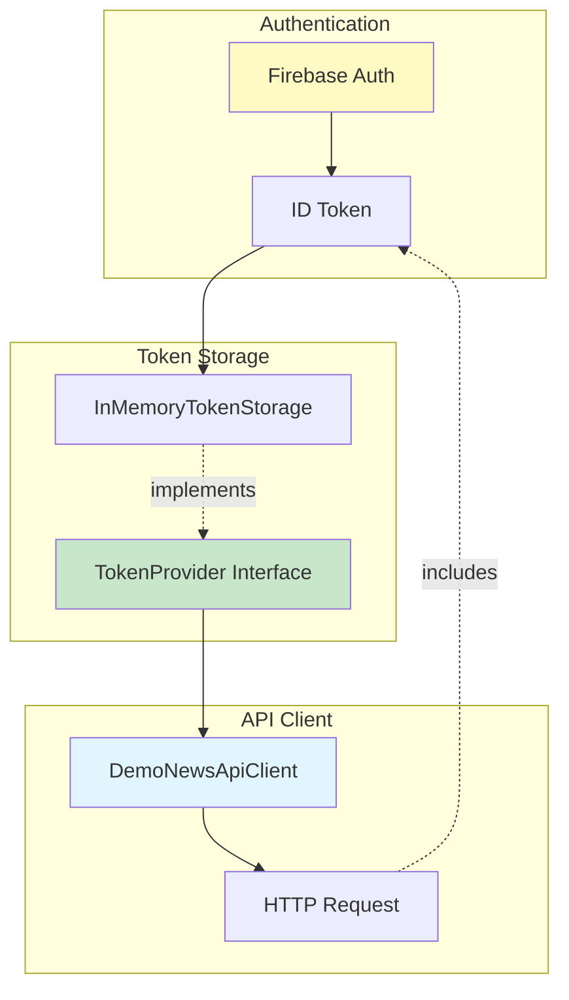

### Token Injection Flow

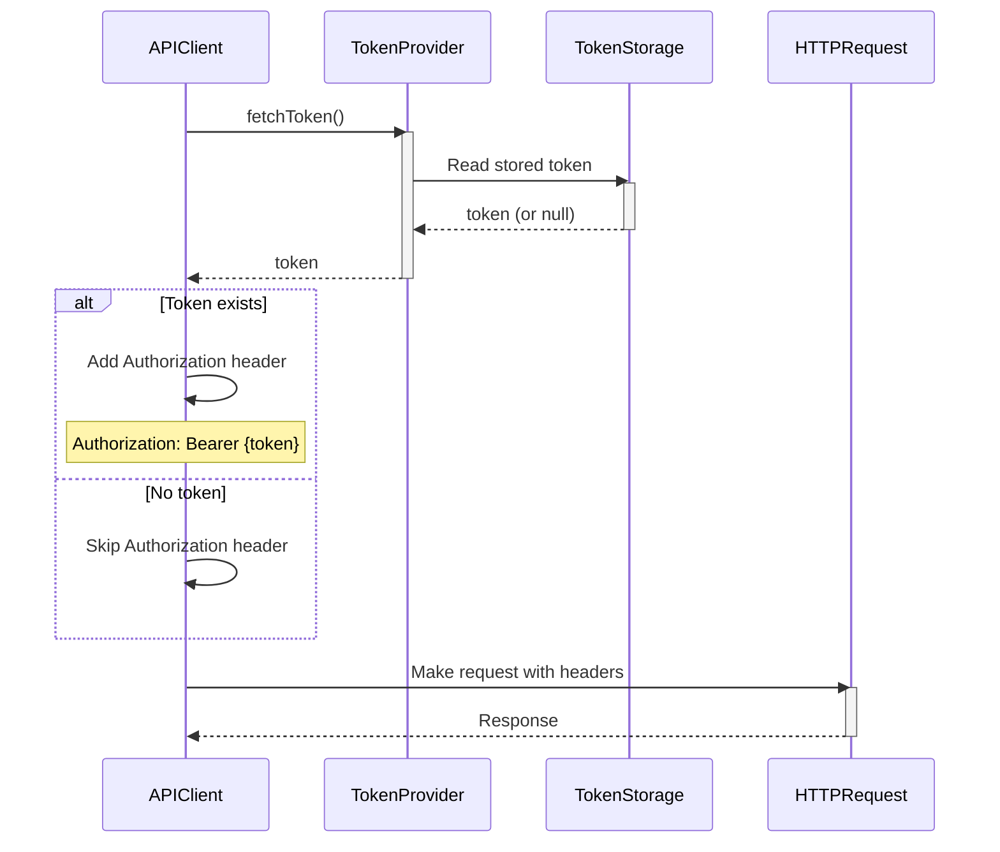

### Token Storage Interface

```dart
abstract class TokenStorage {
  /// Fetches the current token
  Future<String?> fetchToken();

  /// Saves a new token
  Future<void> saveToken(String token);

  /// Clears the stored token
  Future<void> clearToken();
}

class InMemoryTokenStorage implements TokenStorage {
  String? _token;

  @override
  Future<String?> fetchToken() async => _token;

  @override
  Future<void> saveToken(String token) async => _token = token;

  @override
  Future<void> clearToken() async => _token = null;
}
```

## HTTP Client Configuration

### Request Headers

```dart
final headers = <String, String>{
  'Content-Type': 'application/json; charset=utf-8',
  'Accept': 'application/json',
};

// Add token if available
final token = await tokenProvider.fetchToken();
if (token != null) {
  headers['Authorization'] = 'Bearer $token';
}
```

### Request Builder Pattern

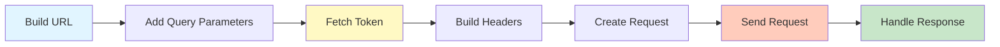

## Real-World Usage Examples

### Example 1: Fetching News Feed

```dart
// 1. BLoC dispatches event
FeedBloc.add(FeedRequested(category: Category.technology));

// 2. BLoC handler calls repository
final response = await newsRepository.getFeed(
  category: Category.technology,
  limit: 10,
  offset: 0,
);

// 3. Repository calls API client
final response = await apiClient.getFeed(
  category: Category.technology,
  limit: 10,
  offset: 0,
);

// 4. API client makes HTTP request
// GET /api/v1/feed?category=technology&limit=10&offset=0
// Headers: Authorization: Bearer {token}

// 5. Response transformed
FeedResponse {
  feed: [Article(id: '1', ...), Article(id: '2', ...)],
  totalCount: 50
}

// 6. BLoC emits success state
emit(FeedState.success(feed: response.feed));
```

### Example 2: Creating Subscription

```dart
// 1. User completes purchase in SubscriptionsBloc
PurchaseBloc.add(PurchaseCompleted(purchaseId: 'abc123'));

// 2. BLoC calls repository
await inAppPurchaseRepository.deliverPurchase(purchaseDetails);

// 3. Repository validates with backend
await apiClient.createSubscription(subscriptionId: 'abc123');

// 4. API client makes POST request
// POST /api/v1/subscriptions
// Headers: Authorization: Bearer {token}
// Body: {"subscriptionId": "abc123"}

// 5. Backend validates purchase with Apple/Google
// 6. Backend updates user subscription plan
// 7. App refreshes user data
await userRepository.fetchUser();
```

## Performance Considerations

### Caching Strategy

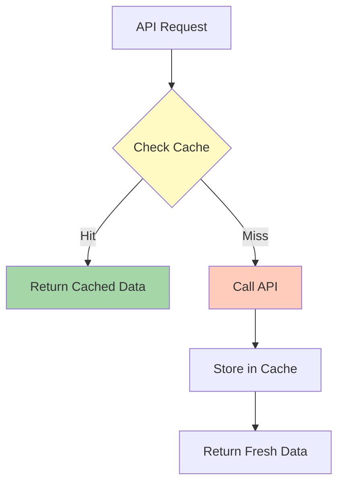

### Optimization Techniques

1. **HydratedBloc Caching**
   - Feed, Article, and Categories BLoCs cache responses
   - Reduces unnecessary API calls
   - Instant loading on app restart

2. **Token Caching**
   - In-memory token storage
   - Avoids repeated Firebase Auth calls

3. **Request Debouncing**
   - Search uses 300ms debounce
   - Prevents excessive API calls during typing

4. **Pagination**
   - Offset-based pagination for feed
   - Limit parameter controls page size
   - Reduces payload size

## Summary

The network layer implements a robust, type-safe API integration:

- **Custom HTTP client** with token injection
- **Type-safe DTOs** with automatic JSON parsing
- **Comprehensive error handling** with custom exceptions
- **Token-based authentication** via Firebase
- **Clean separation** between API responses and domain models
- **10+ endpoints** covering all app features
- **Development/Production** environment support
- **Caching strategies** for performance optimization

The architecture enables easy testing, maintainability, and scalability while providing a reliable network communication layer for the entire application.
