# Storage & State Management

## Table of Contents
- [Overview](#overview)
- [Storage Architecture](#storage-architecture)
- [HydratedBloc Implementation](#hydratedbloc-implementation)
- [SharedPreferences Layer](#sharedpreferences-layer)
- [State Persistence](#state-persistence)
- [Storage Patterns](#storage-patterns)

## Overview

The app uses a multi-layered storage approach combining SharedPreferences for key-value storage and HydratedBloc for automatic state persistence. This ensures data persists across app restarts while maintaining clean architecture principles.

**Key Storage Components:**
- **SharedPreferences** - Native platform storage
- **PersistentStorage** - Abstraction wrapper
- **HydratedBloc** - Automatic state serialization
- **Storage Classes** - Domain-specific storage
- **path_provider** - File system paths

## Storage Architecture

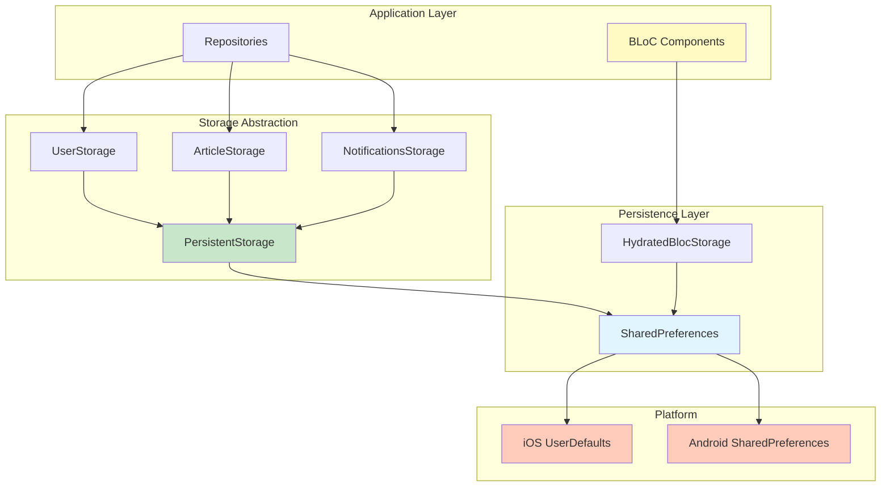

## Storage Hierarchy

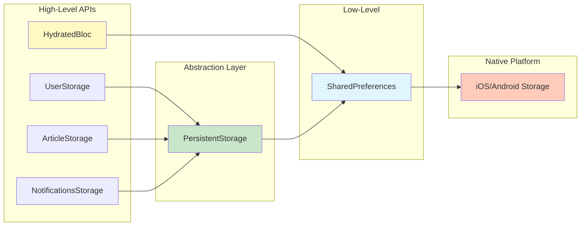

## HydratedBloc Implementation

### What is HydratedBloc?

HydratedBloc automatically persists and restores BLoC state across app sessions. It serializes state to JSON and stores it locally.

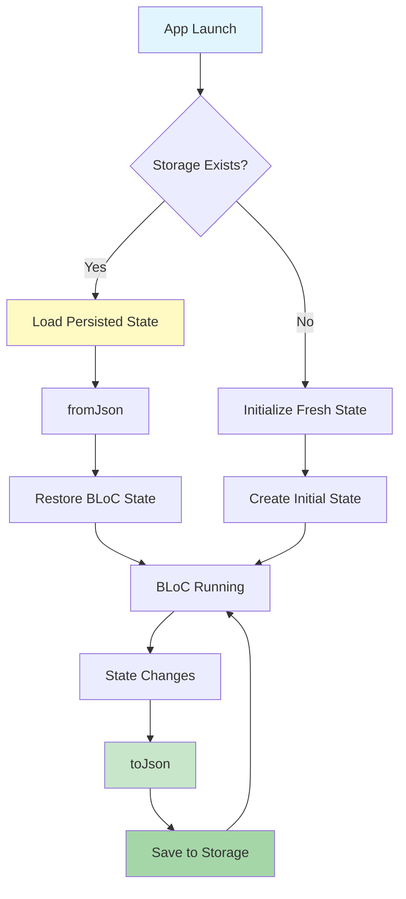

### HydratedBloc BLoCs in the App

```mermaid
graph TB
    subgraph "Persisted BLoCs"
        Feed[FeedBloc]
        Article[ArticleBloc]
        Categories[CategoriesBloc]
    end

    subgraph "Storage"
        Storage[HydratedStorage]
    end

    subgraph "Persisted Data"
        FeedData[News Feed by Category]
        ArticleData[Article Content + View Count]
        CategoriesData[Selected Categories]
    end

    Feed -.persists.-> FeedData
    Article -.persists.-> ArticleData
    Categories -.persists.-> CategoriesData

    FeedData --> Storage
    ArticleData --> Storage
    CategoriesData --> Storage

    style Feed fill:#fff9c4
    style Storage fill:#c8e6c9
```

### HydratedBloc Usage Example

#### FeedBloc Implementation

```dart
class FeedBloc extends HydratedBloc<FeedEvent, FeedState> {
  FeedBloc({
    required NewsRepository newsRepository,
  }) : _newsRepository = newsRepository,
       super(const FeedState.initial());

  final NewsRepository _newsRepository;

  // Serialize state to JSON
  @override
  Map<String, dynamic>? toJson(FeedState state) {
    return state.toJson();
  }

  // Deserialize JSON to state
  @override
  FeedState? fromJson(Map<String, dynamic> json) {
    return FeedState.fromJson(json);
  }
}
```

#### State Serialization Flow

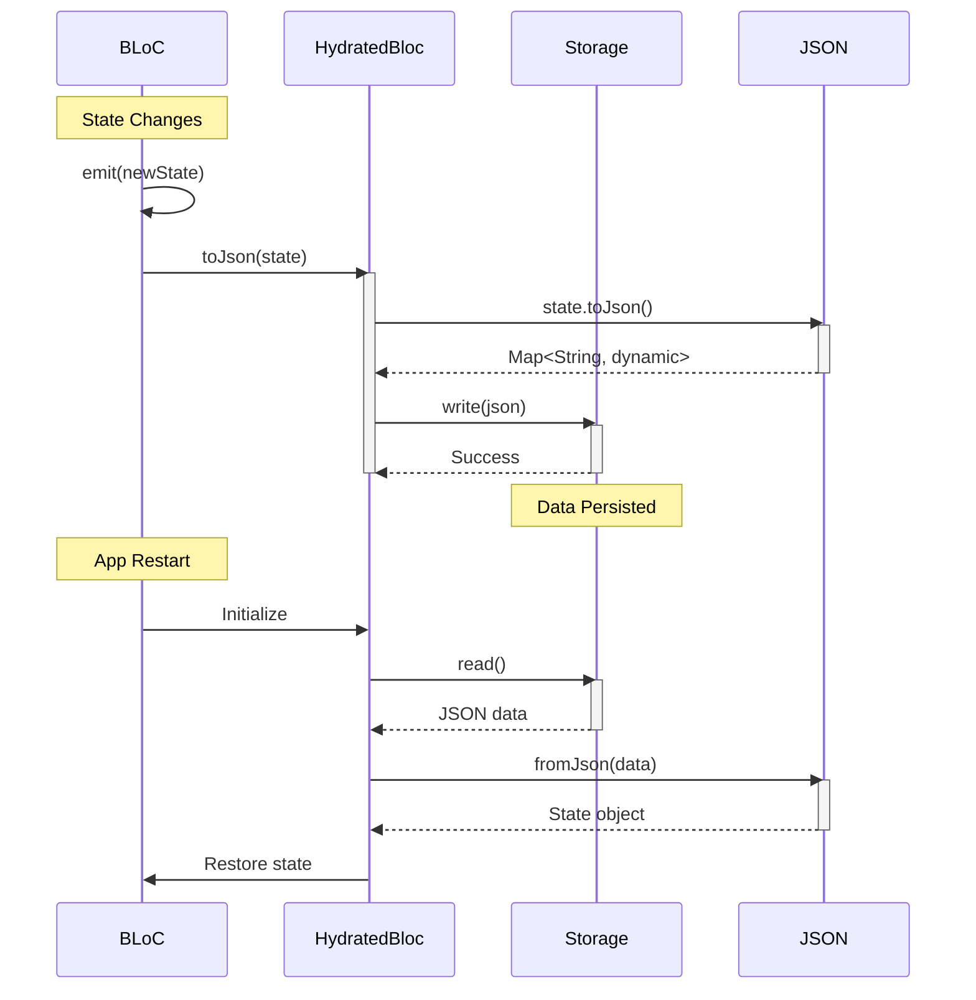

### ArticleBloc with ID-Based Storage

The ArticleBloc uses a unique identifier for each article to maintain separate persisted states.

```dart
class ArticleBloc extends HydratedBloc<ArticleEvent, ArticleState> {
  ArticleBloc({
    required this.articleId,
    required ArticleRepository articleRepository,
  }) : _articleRepository = articleRepository,
       super(const ArticleState.initial());

  final String articleId;

  // Storage ID includes article ID for isolation
  @override
  String get id => articleId;

  @override
  Map<String, dynamic>? toJson(ArticleState state) => state.toJson();

  @override
  ArticleState? fromJson(Map<String, dynamic> json) =>
      ArticleState.fromJson(json);
}
```

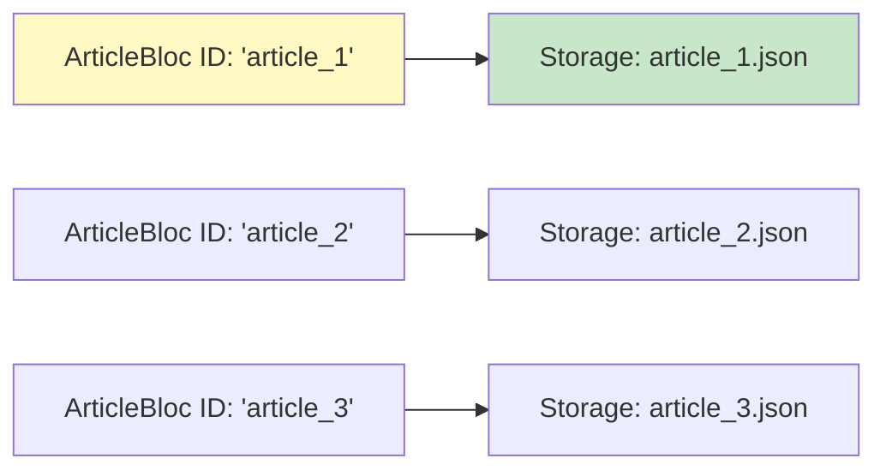

## SharedPreferences Layer

### PersistentStorage Wrapper

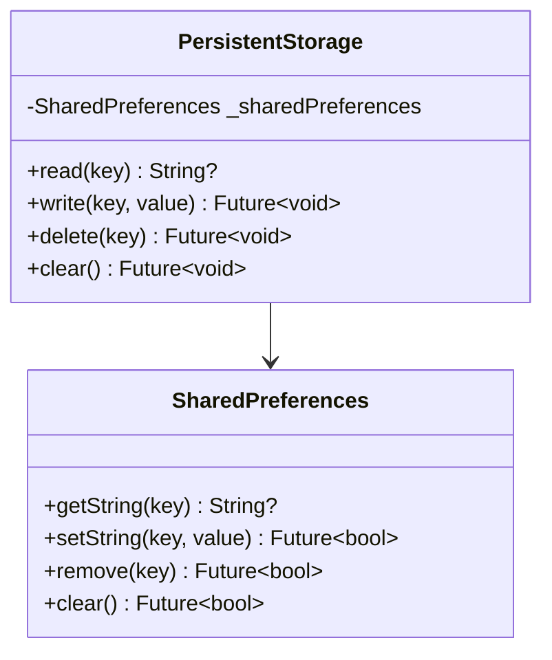

### Storage Interface

```dart
class PersistentStorage {
  const PersistentStorage({
    required SharedPreferences sharedPreferences,
  }) : _sharedPreferences = sharedPreferences;

  final SharedPreferences _sharedPreferences;

  /// Read value by key
  String? read({required String key}) {
    return _sharedPreferences.getString(key);
  }

  /// Write value for key
  Future<void> write({required String key, required String value}) {
    return _sharedPreferences.setString(key, value);
  }

  /// Delete value by key
  Future<void> delete({required String key}) {
    return _sharedPreferences.remove(key);
  }

  /// Clear all stored values
  Future<void> clear() {
    return _sharedPreferences.clear();
  }
}
```

## Domain-Specific Storage Classes

### UserStorage

Manages user-related persistent data.

```dart
class UserStorage {
  const UserStorage({
    required PersistentStorage storage,
  }) : _storage = storage;

  final PersistentStorage _storage;

  static const _appOpenedCountKey = '__app_opened_count_key__';

  /// Fetch app opened count
  int fetchAppOpenedCount() {
    final count = _storage.read(key: _appOpenedCountKey);
    return count != null ? int.parse(count) : 0;
  }

  /// Increment app opened count
  Future<void> incrementAppOpenedCount() {
    final count = fetchAppOpenedCount() + 1;
    return _storage.write(
      key: _appOpenedCountKey,
      value: count.toString(),
    );
  }

  /// Reset app opened count
  Future<void> resetAppOpenedCount() {
    return _storage.delete(key: _appOpenedCountKey);
  }
}
```

### ArticleStorage

Tracks article view limits and ad display frequency.

```dart
class ArticleStorage {
  const ArticleStorage({
    required PersistentStorage storage,
  }) : _storage = storage;

  final PersistentStorage _storage;

  static const _articleViewsKey = '__article_views_key__';
  static const _totalArticleViewsKey = '__total_article_views_key__';

  /// Get remaining article views (4 per day)
  int fetchArticleViews() {
    final views = _storage.read(key: _articleViewsKey);
    return views != null ? int.parse(views) : 4; // Default: 4 views
  }

  /// Increment article views (decrement remaining)
  Future<void> incrementArticleViews() {
    final current = fetchArticleViews();
    if (current > 0) {
      return _storage.write(
        key: _articleViewsKey,
        value: (current - 1).toString(),
      );
    }
    return Future.value();
  }

  /// Reset article views (daily reset)
  Future<void> resetArticleViews() {
    return _storage.write(
      key: _articleViewsKey,
      value: '4',
    );
  }

  /// Decrement views (after watching rewarded ad)
  Future<void> decrementArticleViews() {
    final current = fetchArticleViews();
    return _storage.write(
      key: _articleViewsKey,
      value: (current + 1).toString(),
    );
  }

  /// Get total article views (for ad frequency)
  int fetchTotalArticleViews() {
    final views = _storage.read(key: _totalArticleViewsKey);
    return views != null ? int.parse(views) : 0;
  }

  /// Increment total views
  Future<void> incrementTotalArticleViews() {
    final total = fetchTotalArticleViews() + 1;
    return _storage.write(
      key: _totalArticleViewsKey,
      value: total.toString(),
    );
  }
}
```

### NotificationsStorage

Manages notification preferences.

```dart
class NotificationsStorage {
  const NotificationsStorage({
    required PersistentStorage storage,
  }) : _storage = storage;

  final PersistentStorage _storage;

  static const _notificationsEnabledKey = '__notifications_enabled_key__';
  static const _categoryPreferencesKey = '__category_preferences_key__';

  /// Check if notifications are enabled
  bool fetchNotificationsEnabled() {
    final enabled = _storage.read(key: _notificationsEnabledKey);
    return enabled == 'true';
  }

  /// Set notifications enabled/disabled
  Future<void> setNotificationsEnabled(bool enabled) {
    return _storage.write(
      key: _notificationsEnabledKey,
      value: enabled.toString(),
    );
  }

  /// Get category notification preferences
  Map<Category, bool> fetchCategoryPreferences() {
    final json = _storage.read(key: _categoryPreferencesKey);
    if (json == null) return {};

    final map = jsonDecode(json) as Map<String, dynamic>;
    return map.map(
      (key, value) => MapEntry(
        Category.values.byName(key),
        value as bool,
      ),
    );
  }

  /// Set category preferences
  Future<void> setCategoryPreferences(Map<Category, bool> preferences) {
    final map = preferences.map(
      (key, value) => MapEntry(key.name, value),
    );
    return _storage.write(
      key: _categoryPreferencesKey,
      value: jsonEncode(map),
    );
  }
}
```

## Storage Flow Diagrams

### User App Open Tracking

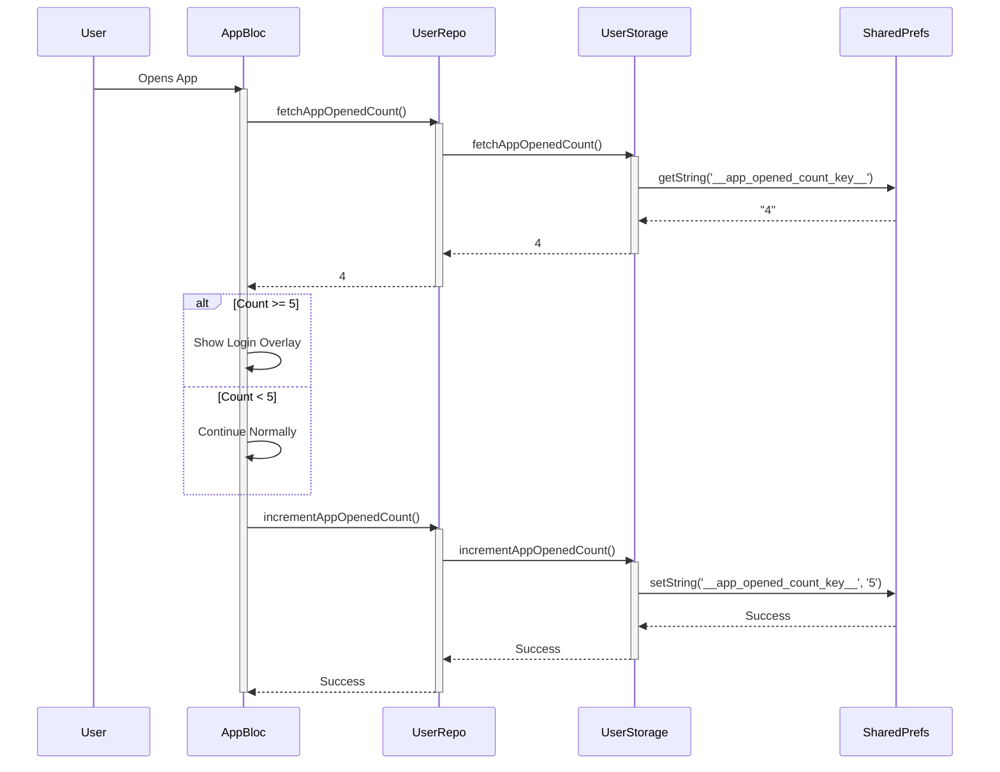

### Article View Limit Tracking

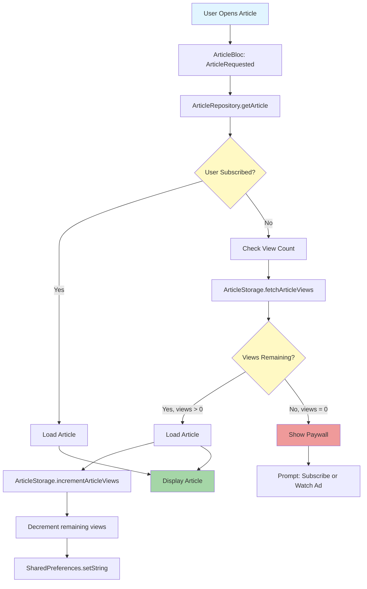

### Feed State Persistence

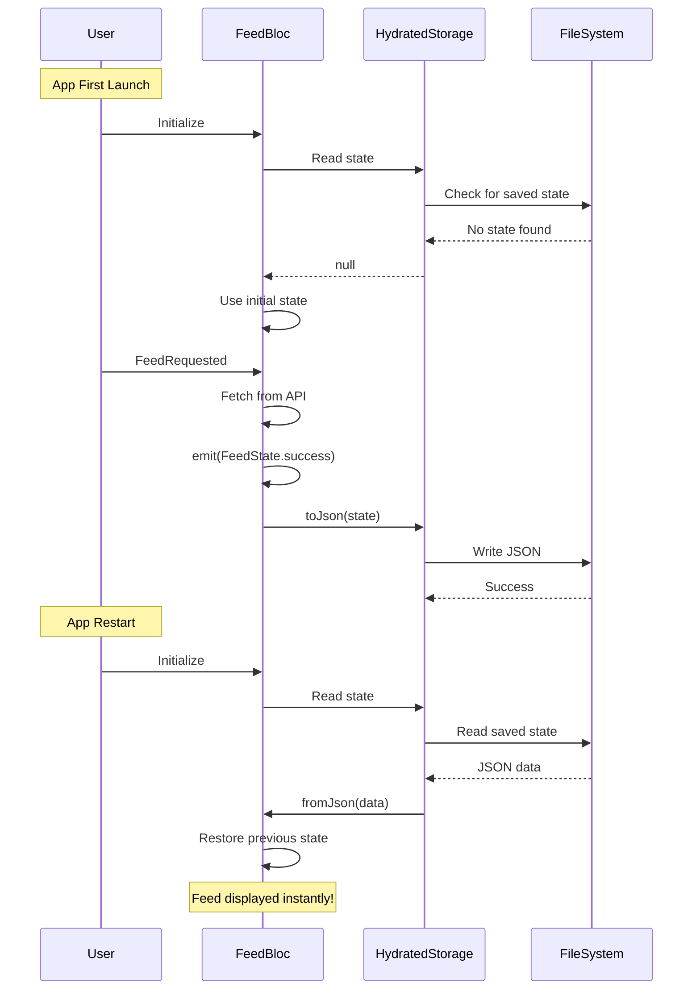

## State Persistence Patterns

### Pattern 1: Automatic Persistence (HydratedBloc)

**Use Case:** Cache entire feature state (feed, articles, categories)

```dart
// Automatically persisted
class FeedState extends Equatable {
  const FeedState({
    this.status = FeedStatus.initial,
    this.feed = const [],
    this.category,
  });

  final FeedStatus status;
  final List<Article> feed;
  final Category? category;

  // Serialization
  Map<String, dynamic> toJson() => {
    'status': status.name,
    'feed': feed.map((article) => article.toJson()).toList(),
    'category': category?.name,
  };

  // Deserialization
  factory FeedState.fromJson(Map<String, dynamic> json) {
    return FeedState(
      status: FeedStatus.values.byName(json['status']),
      feed: (json['feed'] as List)
          .map((item) => Article.fromJson(item))
          .toList(),
      category: json['category'] != null
          ? Category.values.byName(json['category'])
          : null,
    );
  }
}
```

### Pattern 2: Manual Persistence (Storage Classes)

**Use Case:** Simple counters, flags, preferences

```dart
// Manually managed
class UserRepository {
  Future<void> trackAppOpen() async {
    final count = userStorage.fetchAppOpenedCount();
    await userStorage.incrementAppOpenedCount();

    if (count >= 5) {
      // Show login overlay
    }
  }
}
```

### Pattern 3: Hybrid Approach

**Use Case:** Complex state with metadata

```dart
class ArticleBloc extends HydratedBloc<ArticleEvent, ArticleState> {
  // State persisted via HydratedBloc
  @override
  ArticleState? fromJson(Map<String, dynamic> json);

  // View count persisted separately
  Future<void> _trackView() async {
    await articleRepository.incrementArticleViews();
    await articleRepository.incrementTotalArticleViews();
  }
}
```

## Storage Lifecycle

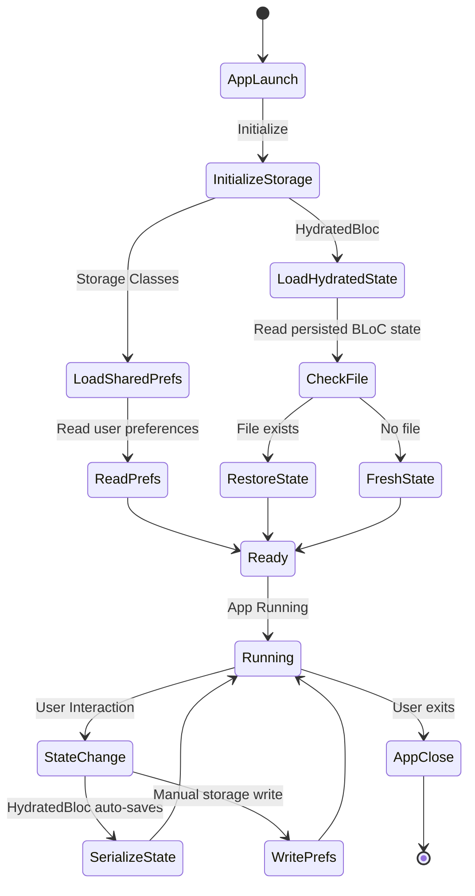

## Development Mode: Storage Clearing

```dart
// main_development.dart
Future<void> bootstrap() async {
  WidgetsFlutterBinding.ensureInitialized();

  // CLEAR storage in development
  final storage = await HydratedStorage.build(
    storageDirectory: await getApplicationSupportDirectory(),
  );

  await storage.clear(); // Clear all persisted state

  HydratedBlocOverrides.runZoned(
    () => runApp(const App()),
    storage: storage,
  );
}
```

## Storage Locations

### iOS
```
/Users/<user>/Library/Developer/CoreSimulator/Devices/<device>/
  data/Containers/Data/Application/<app>/
    Library/Preferences/com.demo.news.plist  (SharedPreferences)
    Library/Application Support/              (HydratedBloc)
```

### Android
```
/data/data/com.demo.news/
  shared_prefs/FlutterSharedPreferences.xml  (SharedPreferences)
  files/                                      (HydratedBloc)
```

## Performance Considerations

### Storage Performance

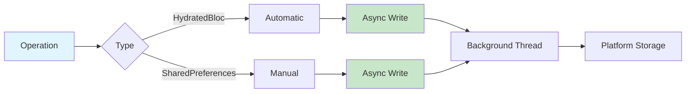

### Optimization Techniques

1. **Lazy Loading**: Only deserialize state when BLoC is accessed
2. **Selective Persistence**: Only persist necessary state fields
3. **Compression**: JSON serialization is space-efficient
4. **Batching**: SharedPreferences batches writes automatically

## Error Handling

```dart
// HydratedBloc error handling
@override
FeedState? fromJson(Map<String, dynamic> json) {
  try {
    return FeedState.fromJson(json);
  } catch (error) {
    // Log error and return null (falls back to initial state)
    debugPrint('Failed to restore FeedState: $error');
    return null;
  }
}

// Storage error handling
Future<void> write(String key, String value) async {
  try {
    await _storage.write(key: key, value: value);
  } catch (error) {
    // Handle storage errors gracefully
    debugPrint('Storage write failed: $error');
  }
}
```

## Summary

The storage layer provides:

- **Two-tier storage**: HydratedBloc for state, SharedPreferences for simple data
- **Automatic persistence**: BLoC state saved/restored transparently
- **Domain-specific storage**: UserStorage, ArticleStorage, NotificationsStorage
- **Type-safe APIs**: Clear interfaces for all storage operations
- **Development support**: Storage clearing in dev mode
- **Platform integration**: Native iOS/Android storage
- **Error resilience**: Graceful fallback when restoration fails
- **Performance**: Async operations, background threads, compression

This architecture ensures data persistence while maintaining clean separation between business logic and storage implementation.
