# Authentication & User Management

## Table of Contents
- [Overview](#overview)
- [Authentication Architecture](#authentication-architecture)
- [Login Methods](#login-methods)
- [Authentication Flows](#authentication-flows)
- [Token Management](#token-management)
- [User Management](#user-management)
- [Appwrite Integration](#appwrite-integration)

## Overview

The app implements a comprehensive multi-provider authentication system supporting 5 different login methods. Authentication is built on Firebase Auth with an abstraction layer allowing alternative backends like Appwrite.

**Supported Login Methods:**
1. Email Magic Link (passwordless)
2. Google Sign-In
3. Apple Sign-In
4. Facebook Login
5. Twitter Login

**Key Components:**
- **FirebaseAuthenticationClient** - Firebase Auth wrapper
- **UserRepository** - User management & authentication logic
- **AppBloc** - App-wide authentication state
- **LoginBloc** - Login UI state management
- **Deep Link Client** - Magic link handling

## Authentication Architecture

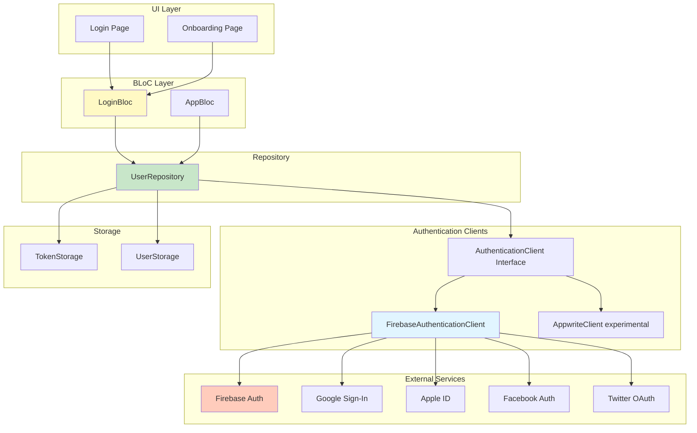
```mermaid
graph TB
    subgraph "UI Layer"
        LoginPage[Login Page]
        OnboardingPage[Onboarding Page]
    end

    subgraph "BLoC Layer"
        AppBloc[AppBloc]
        LoginBloc[LoginBloc]
    end

    subgraph "Repository"
        UserRepo[UserRepository]
    end

    subgraph "Authentication Clients"
        AuthClient[AuthenticationClient Interface]
        FirebaseClient[FirebaseAuthenticationClient]
        AppwriteClient[AppwriteClient experimental]
    end

    subgraph "External Services"
        Firebase[Firebase Auth]
        Google[Google Sign-In]
        Apple[Apple ID]
        Facebook[Facebook Auth]
        Twitter[Twitter OAuth]
    end

    subgraph "Storage"
        TokenStorage[TokenStorage]
        UserStorage[UserStorage]
    end

    LoginPage --> LoginBloc
    OnboardingPage --> LoginBloc
    LoginBloc --> UserRepo
    AppBloc --> UserRepo

    UserRepo --> AuthClient
    AuthClient --> FirebaseClient
    AuthClient --> AppwriteClient

    FirebaseClient --> Firebase
    FirebaseClient --> Google
    FirebaseClient --> Apple
    FirebaseClient --> Facebook
    FirebaseClient --> Twitter

    UserRepo --> TokenStorage
    UserRepo --> UserStorage

    style LoginBloc fill:#fff9c4
    style UserRepo fill:#c8e6c9
    style FirebaseClient fill:#e1f5ff
    style Firebase fill:#ffccbc
```

## Clean Authentication Layers

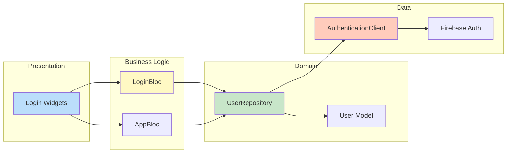
```mermaid
graph LR
    subgraph "Presentation"
        A[Login Widgets]
    end

    subgraph "Business Logic"
        B[LoginBloc]
        C[AppBloc]
    end

    subgraph "Domain"
        D[UserRepository]
        E[User Model]
    end

    subgraph "Data"
        F[AuthenticationClient]
        G[Firebase Auth]
    end

    A --> B
    A --> C
    B --> D
    C --> D
    D --> E
    D --> F
    F --> G

    style A fill:#bbdefb
    style B fill:#fff9c4
    style D fill:#c8e6c9
    style F fill:#ffccbc
```

## Login Methods

### 1. Email Magic Link (Passwordless)

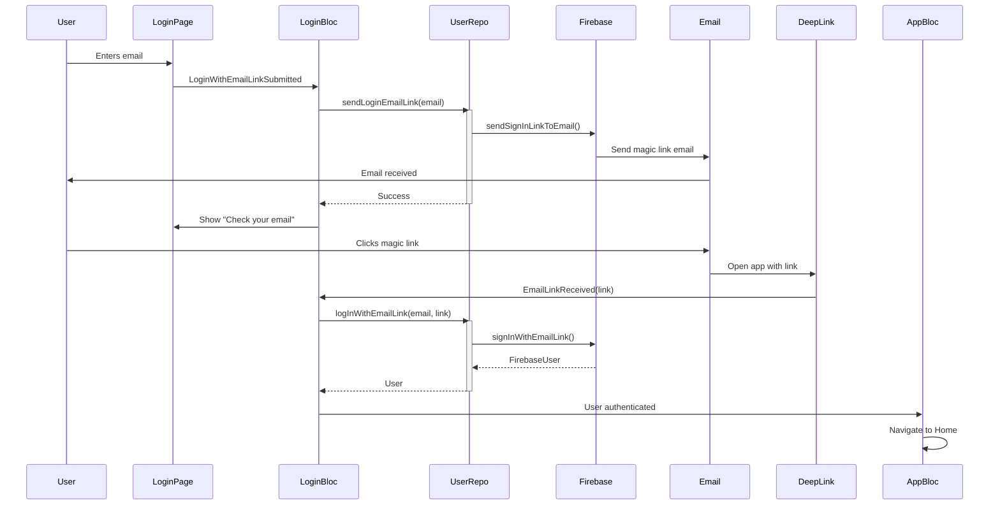
```mermaid
sequenceDiagram
    participant User
    participant LoginPage
    participant LoginBloc
    participant UserRepo
    participant Firebase
    participant Email
    participant DeepLink

    User->>LoginPage: Enters email
    LoginPage->>LoginBloc: LoginWithEmailLinkSubmitted
    LoginBloc->>UserRepo: sendLoginEmailLink(email)
    activate UserRepo

    UserRepo->>Firebase: sendSignInLinkToEmail()
    Firebase->>Email: Send magic link email
    Email->>User: Email received

    UserRepo-->>LoginBloc: Success
    deactivate UserRepo
    LoginBloc->>LoginPage: Show "Check your email"

    User->>Email: Clicks magic link
    Email->>DeepLink: Open app with link
    DeepLink->>LoginBloc: EmailLinkReceived(link)

    LoginBloc->>UserRepo: logInWithEmailLink(email, link)
    activate UserRepo
    UserRepo->>Firebase: signInWithEmailLink()
    Firebase-->>UserRepo: FirebaseUser
    UserRepo-->>LoginBloc: User
    deactivate UserRepo

    LoginBloc->>AppBloc: User authenticated
    AppBloc->>AppBloc: Navigate to Home
```

### 2. Google Sign-In

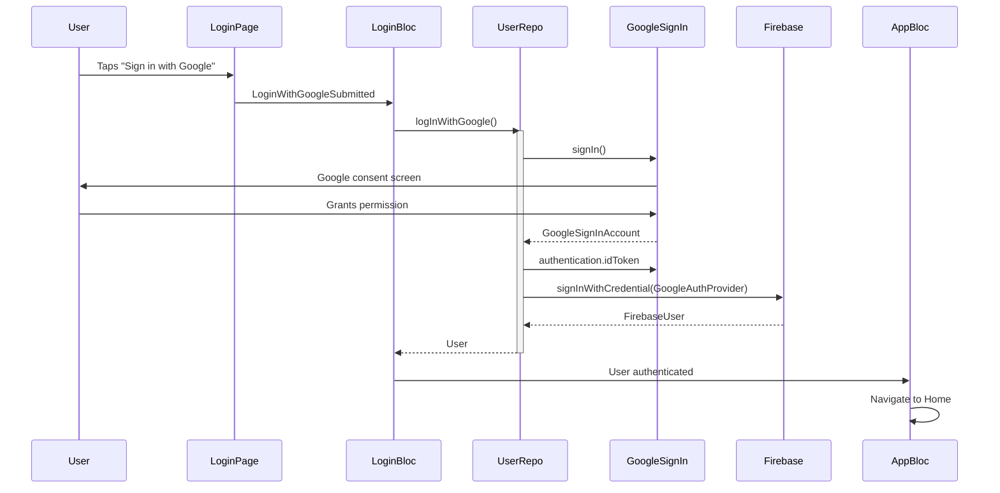
```mermaid
sequenceDiagram
    participant User
    participant LoginPage
    participant LoginBloc
    participant UserRepo
    participant GoogleSignIn
    participant Firebase

    User->>LoginPage: Taps "Sign in with Google"
    LoginPage->>LoginBloc: LoginWithGoogleSubmitted
    LoginBloc->>UserRepo: logInWithGoogle()
    activate UserRepo

    UserRepo->>GoogleSignIn: signIn()
    GoogleSignIn->>User: Google consent screen
    User->>GoogleSignIn: Grants permission
    GoogleSignIn-->>UserRepo: GoogleSignInAccount

    UserRepo->>GoogleSignIn: authentication.idToken
    UserRepo->>Firebase: signInWithCredential(GoogleAuthProvider)
    Firebase-->>UserRepo: FirebaseUser
    UserRepo-->>LoginBloc: User
    deactivate UserRepo

    LoginBloc->>AppBloc: User authenticated
    AppBloc->>AppBloc: Navigate to Home
```

### 3. Apple Sign-In

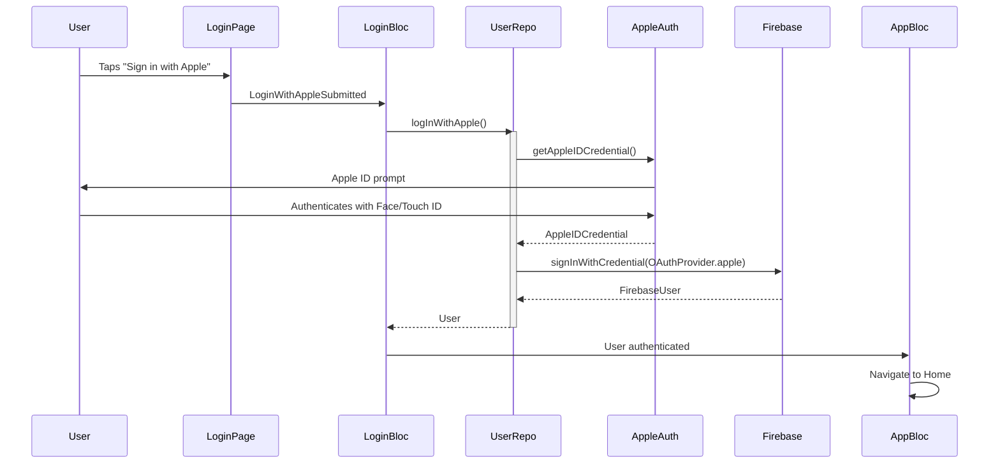
```mermaid
sequenceDiagram
    participant User
    participant LoginPage
    participant LoginBloc
    participant UserRepo
    participant AppleAuth
    participant Firebase

    User->>LoginPage: Taps "Sign in with Apple"
    LoginPage->>LoginBloc: LoginWithAppleSubmitted
    LoginBloc->>UserRepo: logInWithApple()
    activate UserRepo

    UserRepo->>AppleAuth: getAppleIDCredential()
    AppleAuth->>User: Apple ID prompt
    User->>AppleAuth: Authenticates with Face/Touch ID
    AppleAuth-->>UserRepo: AppleIDCredential

    UserRepo->>Firebase: signInWithCredential(OAuthProvider.apple)
    Firebase-->>UserRepo: FirebaseUser
    UserRepo-->>LoginBloc: User
    deactivate UserRepo

    LoginBloc->>AppBloc: User authenticated
    AppBloc->>AppBloc: Navigate to Home
```

### 4. Facebook Login

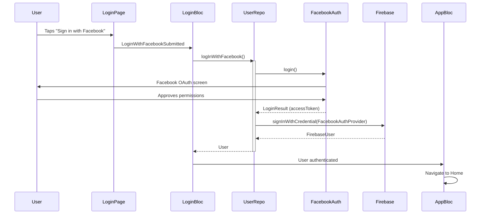
```mermaid
sequenceDiagram
    participant User
    participant LoginPage
    participant LoginBloc
    participant UserRepo
    participant FacebookAuth
    participant Firebase

    User->>LoginPage: Taps "Sign in with Facebook"
    LoginPage->>LoginBloc: LoginWithFacebookSubmitted
    LoginBloc->>UserRepo: logInWithFacebook()
    activate UserRepo

    UserRepo->>FacebookAuth: login()
    FacebookAuth->>User: Facebook OAuth screen
    User->>FacebookAuth: Approves permissions
    FacebookAuth-->>UserRepo: LoginResult (accessToken)

    UserRepo->>Firebase: signInWithCredential(FacebookAuthProvider)
    Firebase-->>UserRepo: FirebaseUser
    UserRepo-->>LoginBloc: User
    deactivate UserRepo

    LoginBloc->>AppBloc: User authenticated
    AppBloc->>AppBloc: Navigate to Home
```

### 5. Twitter Login

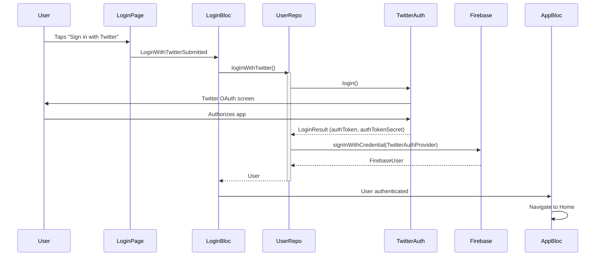
```mermaid
sequenceDiagram
    participant User
    participant LoginPage
    participant LoginBloc
    participant UserRepo
    participant TwitterAuth
    participant Firebase

    User->>LoginPage: Taps "Sign in with Twitter"
    LoginPage->>LoginBloc: LoginWithTwitterSubmitted
    LoginBloc->>UserRepo: logInWithTwitter()
    activate UserRepo

    UserRepo->>TwitterAuth: login()
    TwitterAuth->>User: Twitter OAuth screen
    User->>TwitterAuth: Authorizes app
    TwitterAuth-->>UserRepo: LoginResult (authToken, authTokenSecret)

    UserRepo->>Firebase: signInWithCredential(TwitterAuthProvider)
    Firebase-->>UserRepo: FirebaseUser
    UserRepo-->>LoginBloc: User
    deactivate UserRepo

    LoginBloc->>AppBloc: User authenticated
    AppBloc->>AppBloc: Navigate to Home
```

## Complete Authentication Flow

### App Startup Authentication Check

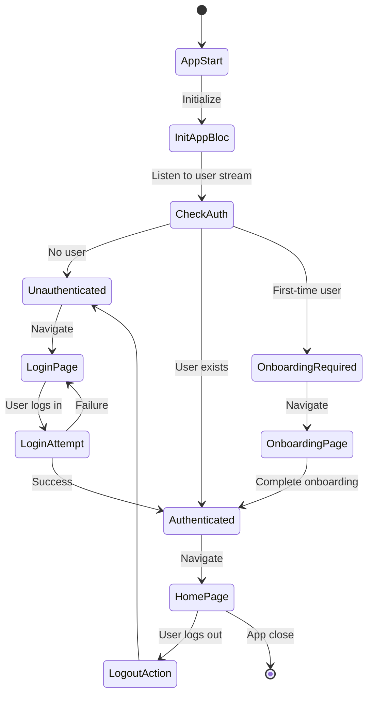
```mermaid
stateDiagram-v2
    [*] --> AppStart

    AppStart --> InitAppBloc: Initialize
    InitAppBloc --> CheckAuth: Listen to user stream

    CheckAuth --> Unauthenticated: No user
    CheckAuth --> Authenticated: User exists
    CheckAuth --> OnboardingRequired: First-time user

    Unauthenticated --> LoginPage: Navigate
    LoginPage --> LoginAttempt: User logs in
    LoginAttempt --> Authenticated: Success
    LoginAttempt --> LoginPage: Failure

    OnboardingRequired --> OnboardingPage: Navigate
    OnboardingPage --> Authenticated: Complete onboarding

    Authenticated --> HomePage: Navigate
    HomePage --> LogoutAction: User logs out
    LogoutAction --> Unauthenticated

    HomePage --> [*]: App close
```

### AppBloc State Management

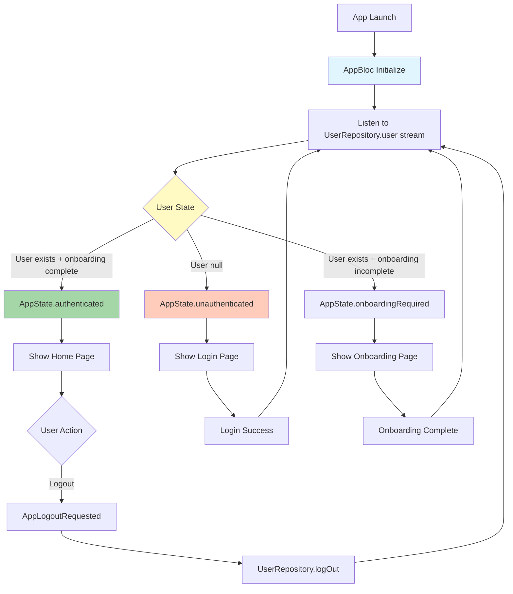
```mermaid
graph TB
    Start[App Launch] --> Init[AppBloc Initialize]
    Init --> Stream[Listen to UserRepository.user stream]

    Stream --> Check{User State}

    Check -->|User null| Unauth[AppState.unauthenticated]
    Check -->|User exists + onboarding incomplete| Onboard[AppState.onboardingRequired]
    Check -->|User exists + onboarding complete| Auth[AppState.authenticated]

    Unauth --> LoginUI[Show Login Page]
    Onboard --> OnboardUI[Show Onboarding Page]
    Auth --> HomeUI[Show Home Page]

    HomeUI --> UserAction{User Action}
    UserAction -->|Logout| LogoutEvent[AppLogoutRequested]
    LogoutEvent --> CallRepo[UserRepository.logOut]
    CallRepo --> Stream

    LoginUI --> LoginSuccess[Login Success]
    LoginSuccess --> Stream

    OnboardUI --> OnboardComplete[Onboarding Complete]
    OnboardComplete --> Stream

    style Init fill:#e1f5ff
    style Check fill:#fff9c4
    style Auth fill:#a5d6a7
    style Unauth fill:#ffccbc
```

## User Repository Implementation

### UserRepository Class Structure

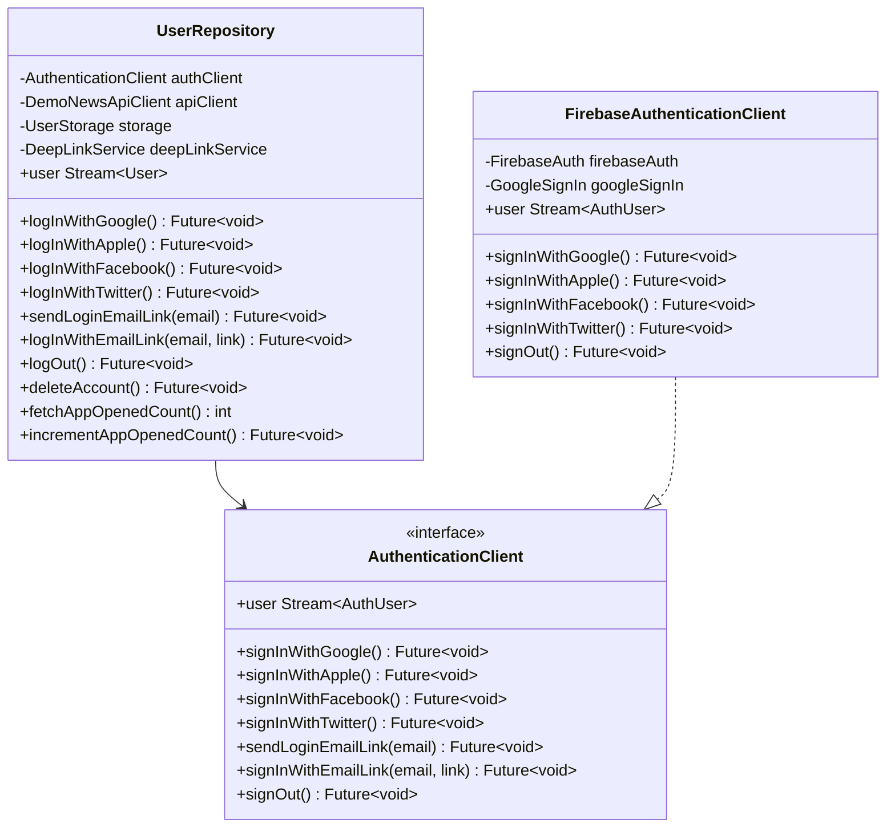
```mermaid
classDiagram
    class UserRepository {
        -AuthenticationClient authClient
        -DemoNewsApiClient apiClient
        -UserStorage storage
        -DeepLinkService deepLinkService

        +user Stream~User~
        +logInWithGoogle() Future~void~
        +logInWithApple() Future~void~
        +logInWithFacebook() Future~void~
        +logInWithTwitter() Future~void~
        +sendLoginEmailLink(email) Future~void~
        +logInWithEmailLink(email, link) Future~void~
        +logOut() Future~void~
        +deleteAccount() Future~void~
        +fetchAppOpenedCount() int
        +incrementAppOpenedCount() Future~void~
    }

    class AuthenticationClient {
        <<interface>>
        +user Stream~AuthUser~
        +signInWithGoogle() Future~void~
        +signInWithApple() Future~void~
        +signInWithFacebook() Future~void~
        +signInWithTwitter() Future~void~
        +sendLoginEmailLink(email) Future~void~
        +signInWithEmailLink(email, link) Future~void~
        +signOut() Future~void~
    }

    class FirebaseAuthenticationClient {
        -FirebaseAuth firebaseAuth
        -GoogleSignIn googleSignIn
        +user Stream~AuthUser~
        +signInWithGoogle() Future~void~
        +signInWithApple() Future~void~
        +signInWithFacebook() Future~void~
        +signInWithTwitter() Future~void~
        +signOut() Future~void~
    }

    UserRepository --> AuthenticationClient
    FirebaseAuthenticationClient ..|> AuthenticationClient
```

### User Stream Composition

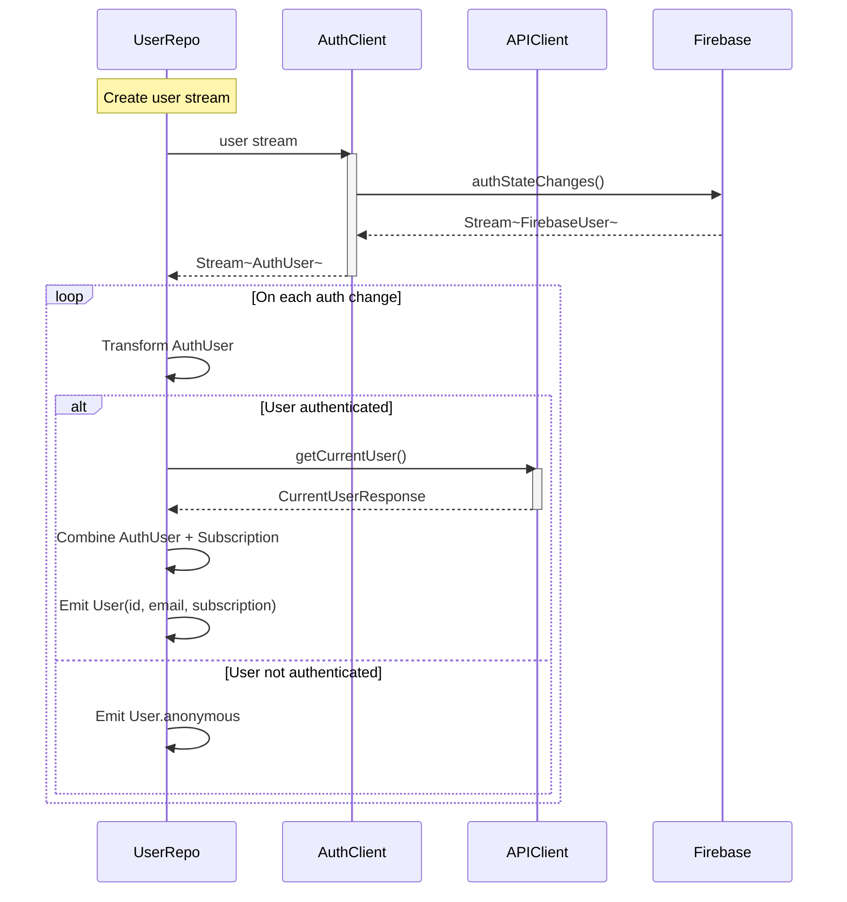
```mermaid
sequenceDiagram
    participant UserRepo
    participant AuthClient
    participant APIClient
    participant Firebase

    Note over UserRepo: Create user stream
    UserRepo->>AuthClient: user stream
    activate AuthClient
    AuthClient->>Firebase: authStateChanges()
    Firebase-->>AuthClient: Stream~FirebaseUser~
    AuthClient-->>UserRepo: Stream~AuthUser~
    deactivate AuthClient

    loop On each auth change
        UserRepo->>UserRepo: Transform AuthUser

        alt User authenticated
            UserRepo->>APIClient: getCurrentUser()
            activate APIClient
            APIClient-->>UserRepo: CurrentUserResponse
            deactivate APIClient
            UserRepo->>UserRepo: Combine AuthUser + Subscription
            UserRepo->>UserRepo: Emit User(id, email, subscription)
        else User not authenticated
            UserRepo->>UserRepo: Emit User.anonymous
        end
    end
```

## Token Management

### Token Flow

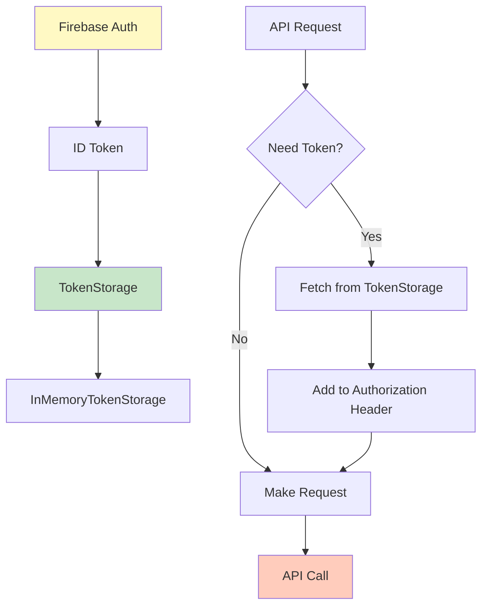
```mermaid
graph TB
    A[Firebase Auth] --> B[ID Token]
    B --> C[TokenStorage]
    C --> D[InMemoryTokenStorage]

    E[API Request] --> F{Need Token?}
    F -->|Yes| G[Fetch from TokenStorage]
    F -->|No| H[Make Request]

    G --> I[Add to Authorization Header]
    I --> H

    H --> J[API Call]

    style A fill:#fff9c4
    style C fill:#c8e6c9
    style J fill:#ffccbc
```

### Token Refresh

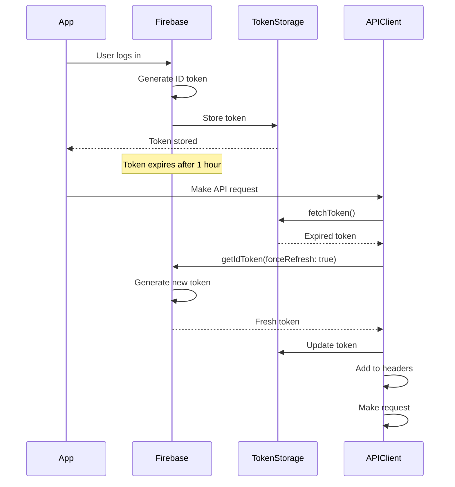
```mermaid
sequenceDiagram
    participant App
    participant Firebase
    participant TokenStorage
    participant APIClient

    App->>Firebase: User logs in
    Firebase->>Firebase: Generate ID token
    Firebase->>TokenStorage: Store token
    TokenStorage-->>App: Token stored

    Note over Firebase: Token expires after 1 hour

    App->>APIClient: Make API request
    APIClient->>TokenStorage: fetchToken()
    TokenStorage-->>APIClient: Expired token
    APIClient->>Firebase: getIdToken(forceRefresh: true)
    Firebase->>Firebase: Generate new token
    Firebase-->>APIClient: Fresh token
    APIClient->>TokenStorage: Update token
    APIClient->>APIClient: Add to headers
    APIClient->>APIClient: Make request
```

## App Open Tracking

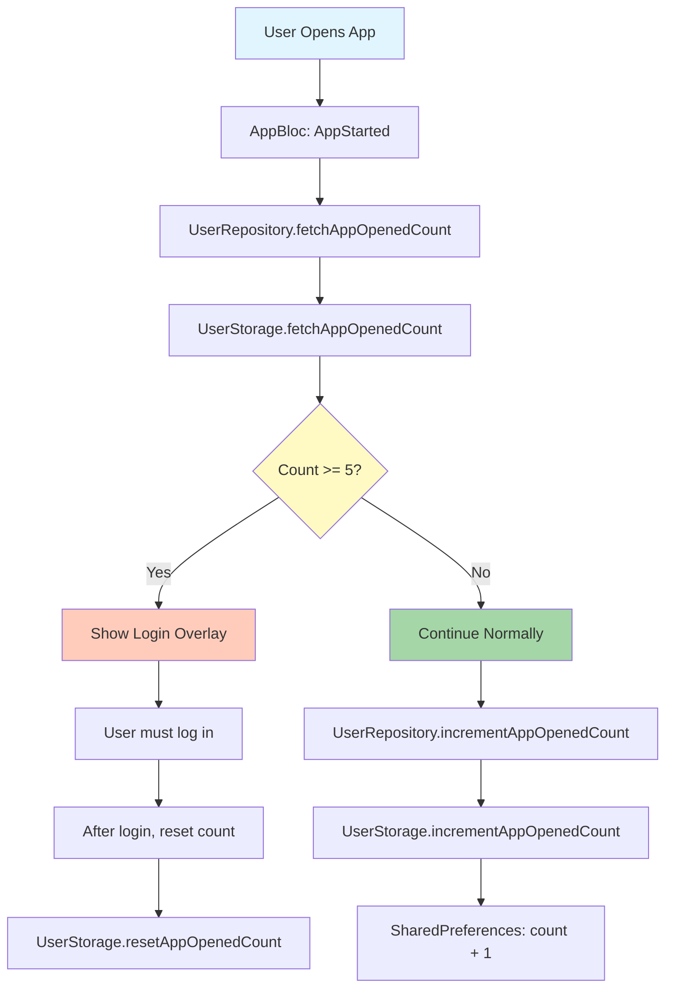
```mermaid
flowchart TD
    A[User Opens App] --> B[AppBloc: AppStarted]
    B --> C[UserRepository.fetchAppOpenedCount]
    C --> D[UserStorage.fetchAppOpenedCount]
    D --> E{Count >= 5?}

    E -->|Yes| F[Show Login Overlay]
    E -->|No| G[Continue Normally]

    F --> H[User must log in]
    G --> I[UserRepository.incrementAppOpenedCount]

    I --> J[UserStorage.incrementAppOpenedCount]
    J --> K[SharedPreferences: count + 1]

    H --> L[After login, reset count]
    L --> M[UserStorage.resetAppOpenedCount]

    style A fill:#e1f5ff
    style E fill:#fff9c4
    style F fill:#ffccbc
    style G fill:#a5d6a7
```

## User Logout Flow

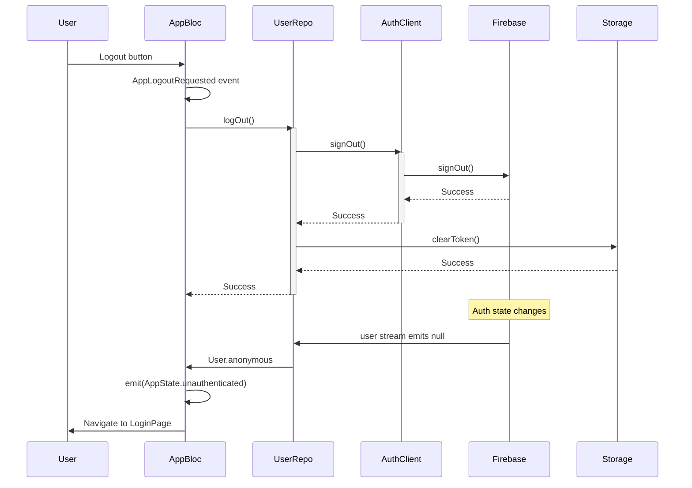
```mermaid
sequenceDiagram
    participant User
    participant AppBloc
    participant UserRepo
    participant AuthClient
    participant Firebase
    participant Storage

    User->>AppBloc: Logout button
    AppBloc->>AppBloc: AppLogoutRequested event
    AppBloc->>UserRepo: logOut()
    activate UserRepo

    UserRepo->>AuthClient: signOut()
    activate AuthClient
    AuthClient->>Firebase: signOut()
    Firebase-->>AuthClient: Success
    AuthClient-->>UserRepo: Success
    deactivate AuthClient

    UserRepo->>Storage: clearToken()
    Storage-->>UserRepo: Success

    UserRepo-->>AppBloc: Success
    deactivate UserRepo

    Note over Firebase: Auth state changes
    Firebase->>UserRepo: user stream emits null
    UserRepo->>AppBloc: User.anonymous
    AppBloc->>AppBloc: emit(AppState.unauthenticated)
    AppBloc->>User: Navigate to LoginPage
```

## Account Deletion Flow

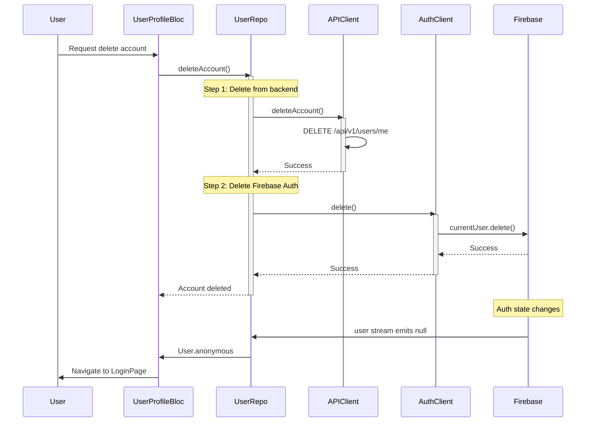
```mermaid
sequenceDiagram
    participant User
    participant UserProfileBloc
    participant UserRepo
    participant APIClient
    participant AuthClient
    participant Firebase

    User->>UserProfileBloc: Request delete account
    UserProfileBloc->>UserRepo: deleteAccount()
    activate UserRepo

    Note over UserRepo: Step 1: Delete from backend
    UserRepo->>APIClient: deleteAccount()
    activate APIClient
    APIClient->>APIClient: DELETE /api/v1/users/me
    APIClient-->>UserRepo: Success
    deactivate APIClient

    Note over UserRepo: Step 2: Delete Firebase Auth
    UserRepo->>AuthClient: delete()
    activate AuthClient
    AuthClient->>Firebase: currentUser.delete()
    Firebase-->>AuthClient: Success
    AuthClient-->>UserRepo: Success
    deactivate AuthClient

    UserRepo-->>UserProfileBloc: Account deleted
    deactivate UserRepo

    Note over Firebase: Auth state changes
    Firebase->>UserRepo: user stream emits null
    UserRepo->>UserProfileBloc: User.anonymous
    UserProfileBloc->>User: Navigate to LoginPage
```

## Appwrite Integration (Experimental)

### Appwrite Architecture

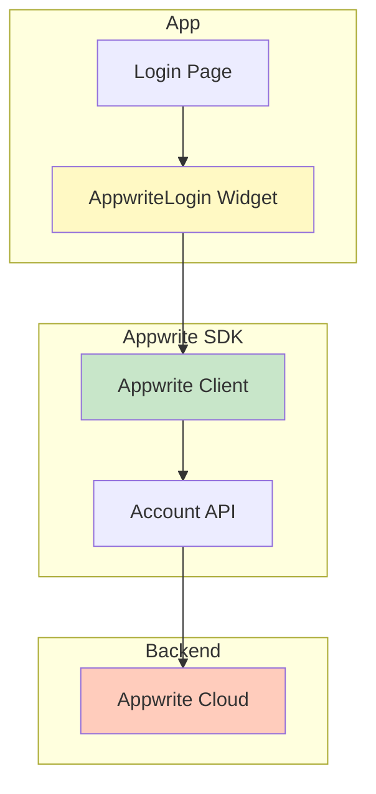
```mermaid
graph TB
    subgraph "App"
        LoginPage[Login Page]
        AppwriteLogin[AppwriteLogin Widget]
    end

    subgraph "Appwrite SDK"
        Client[Appwrite Client]
        Account[Account API]
    end

    subgraph "Backend"
        AppwriteServer[Appwrite Cloud]
    end

    LoginPage --> AppwriteLogin
    AppwriteLogin --> Client
    Client --> Account
    Account --> AppwriteServer

    style AppwriteLogin fill:#fff9c4
    style Client fill:#c8e6c9
    style AppwriteServer fill:#ffccbc
```

### Appwrite Login Flow

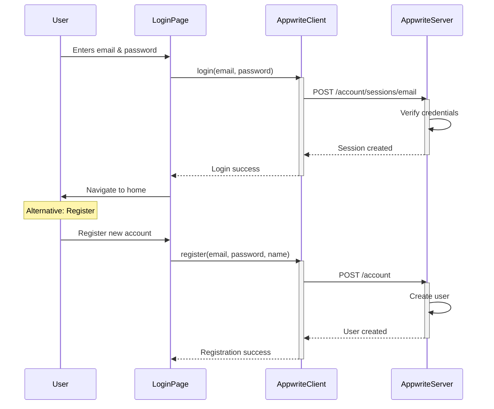
```mermaid
sequenceDiagram
    participant User
    participant LoginPage
    participant AppwriteClient
    participant AppwriteServer

    User->>LoginPage: Enters email & password
    LoginPage->>AppwriteClient: login(email, password)
    activate AppwriteClient

    AppwriteClient->>AppwriteServer: POST /account/sessions/email
    activate AppwriteServer
    AppwriteServer->>AppwriteServer: Verify credentials
    AppwriteServer-->>AppwriteClient: Session created
    deactivate AppwriteServer

    AppwriteClient-->>LoginPage: Login success
    deactivate AppwriteClient

    LoginPage->>User: Navigate to home

    Note over User: Alternative: Register
    User->>LoginPage: Register new account
    LoginPage->>AppwriteClient: register(email, password, name)
    activate AppwriteClient

    AppwriteClient->>AppwriteServer: POST /account
    activate AppwriteServer
    AppwriteServer->>AppwriteServer: Create user
    AppwriteServer-->>AppwriteClient: User created
    deactivate AppwriteServer

    AppwriteClient-->>LoginPage: Registration success
    deactivate AppwriteClient
```

### Appwrite Configuration

```dart
class AppwriteLogin extends StatefulWidget {
  final client = Client()
      .setEndpoint('https://sfo.cloud.appwrite.io/v1')
      .setProject('6911690b003198add805');

  late final Account account = Account(client);

  Future<void> login(String email, String password) async {
    await account.createEmailPasswordSession(
      email: email,
      password: password,
    );
  }

  Future<void> register(String email, String password, String name) async {
    await account.create(
      userId: ID.unique(),
      email: email,
      password: password,
      name: name,
    );
  }

  Future<void> logout() async {
    await account.deleteSession(sessionId: 'current');
  }
}
```

## Security Considerations

### Token Security

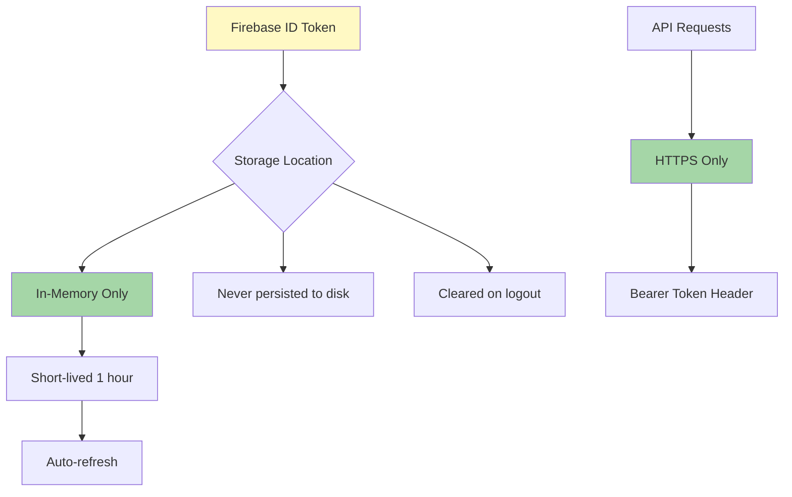
```mermaid
graph TB
    A[Firebase ID Token] --> B{Storage Location}
    B --> C[In-Memory Only]
    B --> D[Never persisted to disk]
    B --> E[Cleared on logout]

    C --> F[Short-lived 1 hour]
    F --> G[Auto-refresh]

    H[API Requests] --> I[HTTPS Only]
    I --> J[Bearer Token Header]

    style A fill:#fff9c4
    style C fill:#a5d6a7
    style I fill:#a5d6a7
```

### Best Practices

1. **Token Management**
   - Tokens stored in-memory only (not persisted)
   - Automatic refresh before expiry
   - Cleared immediately on logout

2. **Password Security**
   - Passwordless login via magic links preferred
   - OAuth providers handle password storage
   - No passwords stored in app

3. **Network Security**
   - HTTPS for all API requests
   - Certificate pinning (if configured)
   - Token in Authorization header only

4. **User Privacy**
   - Minimal data collection
   - Account deletion supported
   - GDPR compliance

## Error Handling

```dart
// UserRepository error handling
try {
  await _authenticationClient.signInWithGoogle();
} on LogInWithGoogleFailure catch (e) {
  throw LogInWithGoogleFailure(e.message);
} catch (e) {
  throw LogInWithGoogleFailure('An unknown error occurred');
}

// LoginBloc error handling
on<LoginWithGoogleSubmitted>((event, emit) async {
  emit(state.copyWith(status: LoginStatus.loading));
  try {
    await _userRepository.logInWithGoogle();
    emit(state.copyWith(status: LoginStatus.success));
  } on LogInWithGoogleFailure catch (e) {
    emit(state.copyWith(
      status: LoginStatus.failure,
      errorMessage: e.message,
    ));
  }
});
```

## Summary

The authentication system provides:

- **Multi-provider support**: 5 login methods (email, Google, Apple, Facebook, Twitter)
- **Passwordless option**: Magic link authentication
- **Clean architecture**: Repository pattern with abstraction layer
- **Firebase integration**: Robust, production-ready auth
- **Alternative backends**: Appwrite support (experimental)
- **Token management**: Secure, automatic refresh
- **User tracking**: App open counts for engagement
- **Account management**: Logout, deletion support
- **Stream-based**: Reactive user state throughout app
- **Error handling**: Comprehensive failure types

This architecture enables secure, scalable authentication while maintaining flexibility to support multiple providers and backends.
