# Ad Implementation & Monetization

## Table of Contents
- [Overview](#overview)
- [Ad Architecture](#ad-architecture)
- [Ad Types](#ad-types)
- [FullScreenAdsBloc](#fullscreenadsbloc)
- [Ad Loading Strategy](#ad-loading-strategy)
- [Rewarded Ad Flow](#rewarded-ad-flow)
- [Interstitial Ad Flow](#interstitial-ad-flow)
- [Ad Consent Management](#ad-consent-management)
- [Monetization Strategy](#monetization-strategy)

## Overview

The app implements Google Mobile Ads for monetization with two ad types: interstitial ads (between content) and rewarded ads (unlock premium content). The ad system is managed by a dedicated BLoC with retry logic and pre-loading for optimal user experience.

**Key Features:**
- **Interstitial Ads**: Full-screen ads every 4 article views
- **Rewarded Ads**: Watch ad to get extra article view
- **Pre-loading**: Ads loaded ahead of time
- **Retry Logic**: Exponential backoff on failures
- **Consent Management**: GDPR/CCPA compliance

## Ad Architecture

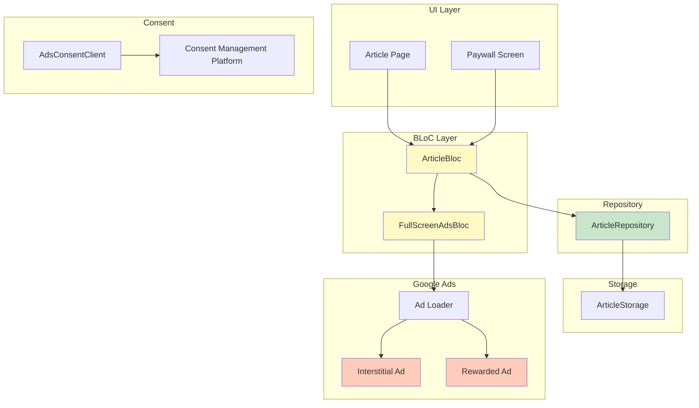
```mermaid
graph TB
    subgraph "UI Layer"
        ArticlePage[Article Page]
        Paywall[Paywall Screen]
    end

    subgraph "BLoC Layer"
        ArticleBloc[ArticleBloc]
        AdsBloc[FullScreenAdsBloc]
    end

    subgraph "Repository"
        ArticleRepo[ArticleRepository]
    end

    subgraph "Storage"
        ArticleStorage[ArticleStorage]
    end

    subgraph "Google Ads"
        InterstitialAd[Interstitial Ad]
        RewardedAd[Rewarded Ad]
        AdLoader[Ad Loader]
    end

    subgraph "Consent"
        ConsentClient[AdsConsentClient]
        CMP[Consent Management Platform]
    end

    ArticlePage --> ArticleBloc
    Paywall --> ArticleBloc
    ArticleBloc --> AdsBloc
    ArticleBloc --> ArticleRepo
    ArticleRepo --> ArticleStorage

    AdsBloc --> AdLoader
    AdLoader --> InterstitialAd
    AdLoader --> RewardedAd

    ConsentClient --> CMP

    style ArticleBloc fill:#fff9c4
    style AdsBloc fill:#fff9c4
    style ArticleRepo fill:#c8e6c9
    style InterstitialAd fill:#ffccbc
    style RewardedAd fill:#ffccbc
```

## Ad Flow Overview

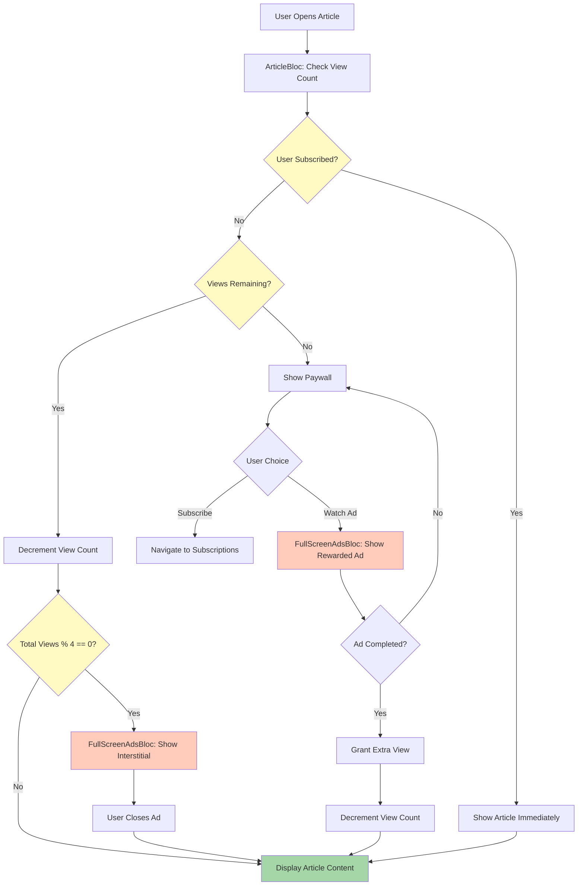
```mermaid
flowchart TD
    A[User Opens Article] --> B[ArticleBloc: Check View Count]
    B --> C{User Subscribed?}

    C -->|Yes| D[Show Article Immediately]
    C -->|No| E{Views Remaining?}

    E -->|Yes| F[Decrement View Count]
    E -->|No| G[Show Paywall]

    F --> H{Total Views % 4 == 0?}
    H -->|Yes| I[FullScreenAdsBloc: Show Interstitial]
    H -->|No| J[Show Article]

    I --> K[User Closes Ad]
    K --> J

    G --> L{User Choice}
    L -->|Subscribe| M[Navigate to Subscriptions]
    L -->|Watch Ad| N[FullScreenAdsBloc: Show Rewarded Ad]

    N --> O{Ad Completed?}
    O -->|Yes| P[Grant Extra View]
    O -->|No| G

    P --> Q[Decrement View Count]
    Q --> J

    D --> J
    J[Display Article Content]

    style C fill:#fff9c4
    style E fill:#fff9c4
    style H fill:#fff9c4
    style I fill:#ffccbc
    style N fill:#ffccbc
    style J fill:#a5d6a7
```

## Ad Types

### 1. Interstitial Ads

**Purpose**: Monetize free users between content
**Frequency**: Every 4 article opens
**Trigger**: Automatic after article load
**Dismissible**: Yes, after a few seconds

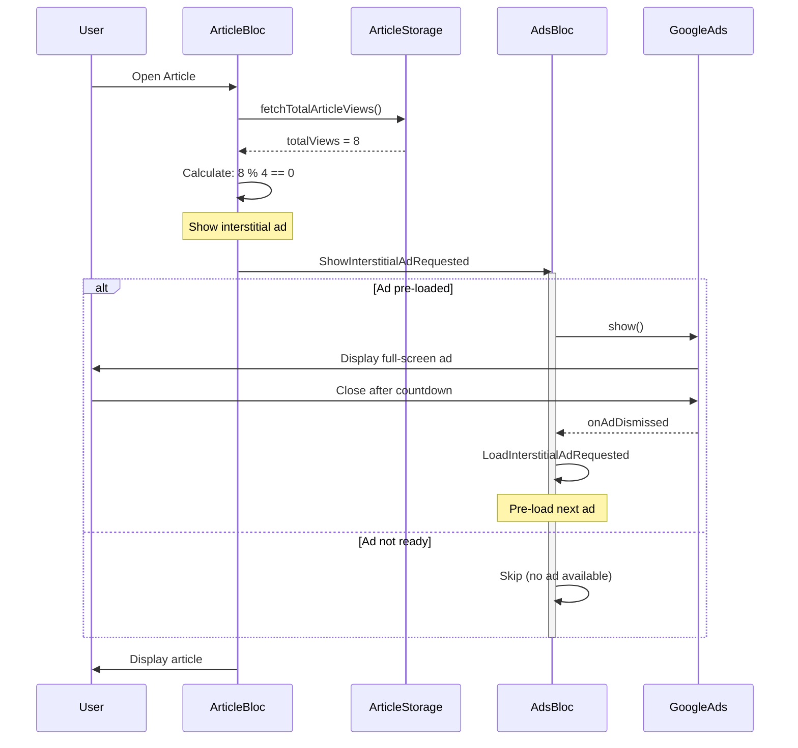
```mermaid
sequenceDiagram
    participant User
    participant ArticleBloc
    participant ArticleStorage
    participant AdsBloc
    participant GoogleAds

    User->>ArticleBloc: Open Article
    ArticleBloc->>ArticleStorage: fetchTotalArticleViews()
    ArticleStorage-->>ArticleBloc: totalViews = 8

    ArticleBloc->>ArticleBloc: Calculate: 8 % 4 == 0
    Note over ArticleBloc: Show interstitial ad

    ArticleBloc->>AdsBloc: ShowInterstitialAdRequested
    activate AdsBloc

    alt Ad pre-loaded
        AdsBloc->>GoogleAds: show()
        GoogleAds->>User: Display full-screen ad
        User->>GoogleAds: Close after countdown
        GoogleAds-->>AdsBloc: onAdDismissed
        AdsBloc->>AdsBloc: LoadInterstitialAdRequested
        Note over AdsBloc: Pre-load next ad
    else Ad not ready
        AdsBloc->>AdsBloc: Skip (no ad available)
    end

    deactivate AdsBloc
    ArticleBloc->>User: Display article
```

### 2. Rewarded Ads

**Purpose**: Give users option to unlock content
**Frequency**: On-demand when view limit reached
**Trigger**: User taps "Watch Ad" button
**Reward**: +1 article view

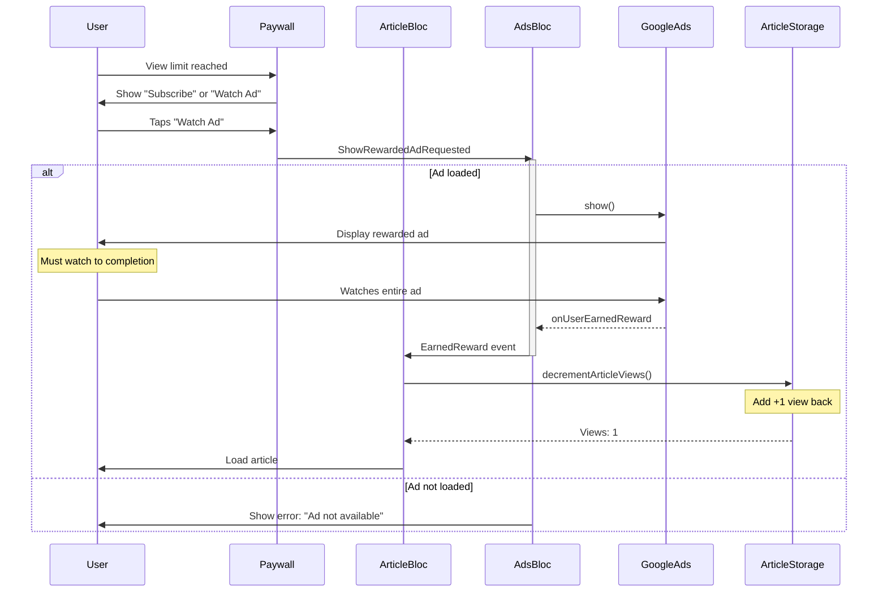
```mermaid
sequenceDiagram
    participant User
    participant Paywall
    participant ArticleBloc
    participant AdsBloc
    participant GoogleAds
    participant ArticleStorage

    User->>Paywall: View limit reached
    Paywall->>User: Show "Subscribe" or "Watch Ad"
    User->>Paywall: Taps "Watch Ad"

    Paywall->>AdsBloc: ShowRewardedAdRequested
    activate AdsBloc

    alt Ad loaded
        AdsBloc->>GoogleAds: show()
        GoogleAds->>User: Display rewarded ad
        Note over User: Must watch to completion

        User->>GoogleAds: Watches entire ad
        GoogleAds-->>AdsBloc: onUserEarnedReward
        AdsBloc->>ArticleBloc: EarnedReward event
        deactivate AdsBloc

        ArticleBloc->>ArticleStorage: decrementArticleViews()
        Note over ArticleStorage: Add +1 view back
        ArticleStorage-->>ArticleBloc: Views: 1
        ArticleBloc->>User: Load article
    else Ad not loaded
        AdsBloc->>User: Show error: "Ad not available"
    end
```

## FullScreenAdsBloc

### BLoC Architecture

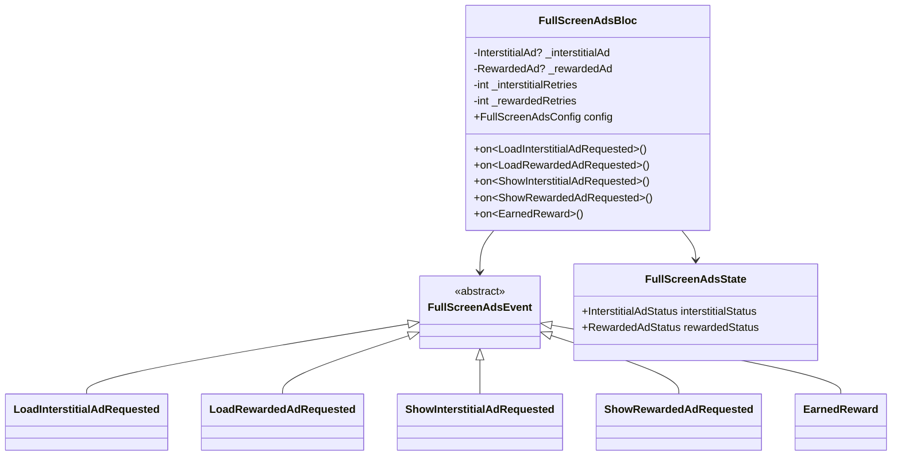
```mermaid
classDiagram
    class FullScreenAdsBloc {
        -InterstitialAd? _interstitialAd
        -RewardedAd? _rewardedAd
        -int _interstitialRetries
        -int _rewardedRetries
        +FullScreenAdsConfig config

        +on~LoadInterstitialAdRequested~()
        +on~LoadRewardedAdRequested~()
        +on~ShowInterstitialAdRequested~()
        +on~ShowRewardedAdRequested~()
        +on~EarnedReward~()
    }

    class FullScreenAdsEvent {
        <<abstract>>
    }

    class LoadInterstitialAdRequested
    class LoadRewardedAdRequested
    class ShowInterstitialAdRequested
    class ShowRewardedAdRequested
    class EarnedReward

    class FullScreenAdsState {
        +InterstitialAdStatus interstitialStatus
        +RewardedAdStatus rewardedStatus
    }

    FullScreenAdsEvent <|-- LoadInterstitialAdRequested
    FullScreenAdsEvent <|-- LoadRewardedAdRequested
    FullScreenAdsEvent <|-- ShowInterstitialAdRequested
    FullScreenAdsEvent <|-- ShowRewardedAdRequested
    FullScreenAdsEvent <|-- EarnedReward

    FullScreenAdsBloc --> FullScreenAdsEvent
    FullScreenAdsBloc --> FullScreenAdsState
```

### Ad States

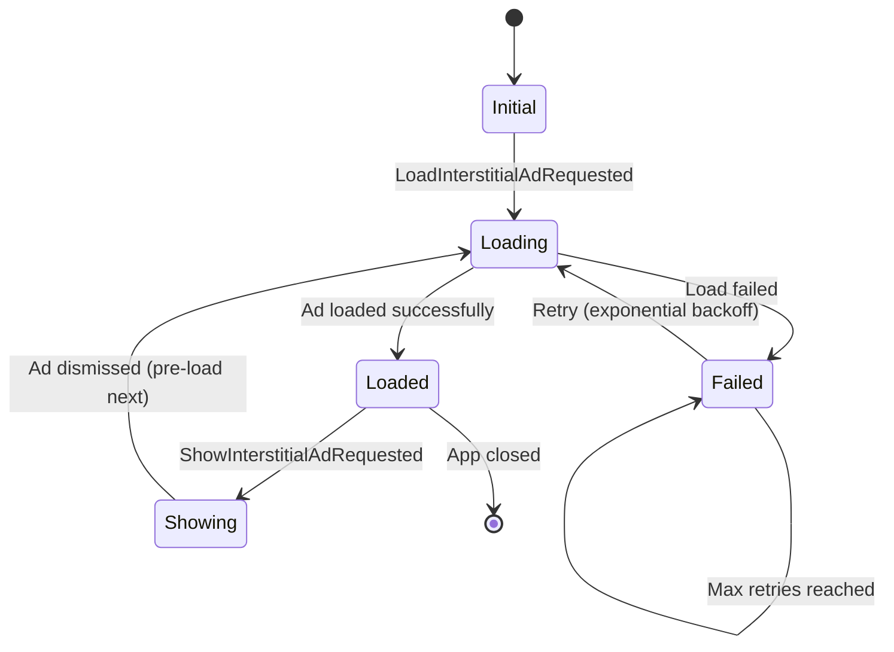
```mermaid
stateDiagram-v2
    [*] --> Initial

    Initial --> Loading: LoadInterstitialAdRequested
    Loading --> Loaded: Ad loaded successfully
    Loading --> Failed: Load failed

    Failed --> Loading: Retry (exponential backoff)
    Failed --> Failed: Max retries reached

    Loaded --> Showing: ShowInterstitialAdRequested
    Showing --> Loading: Ad dismissed (pre-load next)

    Loaded --> [*]: App closed
```

## Ad Loading Strategy

### Pre-loading Pattern

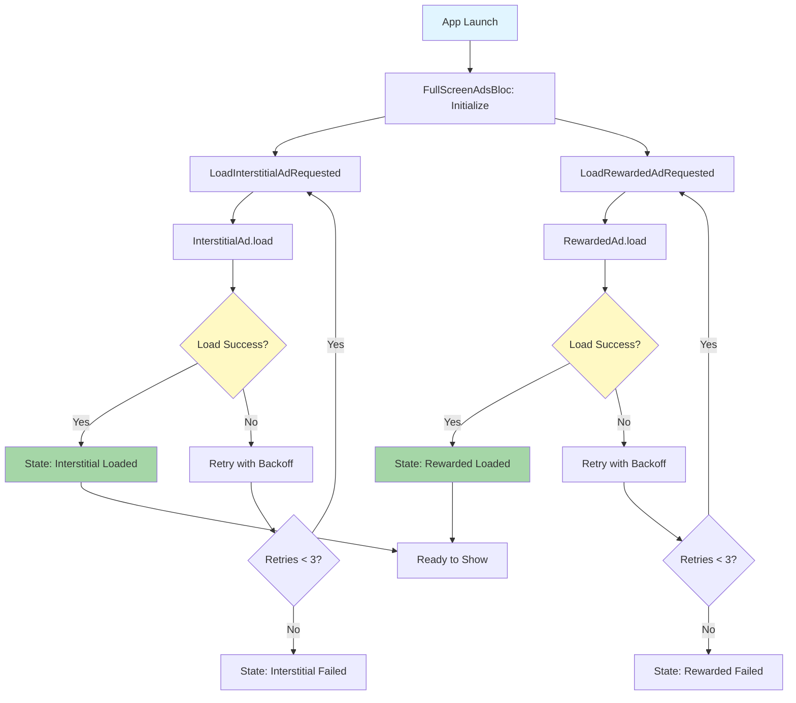
```mermaid
flowchart TD
    A[App Launch] --> B[FullScreenAdsBloc: Initialize]
    B --> C[LoadInterstitialAdRequested]
    B --> D[LoadRewardedAdRequested]

    C --> E[InterstitialAd.load]
    D --> F[RewardedAd.load]

    E --> G{Load Success?}
    F --> H{Load Success?}

    G -->|Yes| I[State: Interstitial Loaded]
    G -->|No| J[Retry with Backoff]

    H -->|Yes| K[State: Rewarded Loaded]
    H -->|No| L[Retry with Backoff]

    J --> M{Retries < 3?}
    M -->|Yes| C
    M -->|No| N[State: Interstitial Failed]

    L --> O{Retries < 3?}
    O -->|Yes| D
    O -->|No| P[State: Rewarded Failed]

    I --> Q[Ready to Show]
    K --> Q

    style A fill:#e1f5ff
    style G fill:#fff9c4
    style H fill:#fff9c4
    style I fill:#a5d6a7
    style K fill:#a5d6a7
```

### Retry Logic with Exponential Backoff

```dart
// Retry delay calculation
int _calculateRetryDelay(int retryCount) {
  // Exponential backoff: 1s, 2s, 4s
  return math.pow(2, retryCount).toInt();
}

// Retry pattern
Future<void> _loadInterstitialAd() async {
  if (_interstitialRetries >= 3) {
    emit(state.copyWith(
      interstitialStatus: InterstitialAdStatus.failed,
    ));
    return;
  }

  try {
    await InterstitialAd.load(
      adUnitId: config.interstitialAdUnitId,
      request: AdRequest(),
      adLoadCallback: InterstitialAdLoadCallback(
        onAdLoaded: (ad) {
          _interstitialAd = ad;
          _interstitialRetries = 0;
          emit(state.copyWith(
            interstitialStatus: InterstitialAdStatus.loaded,
          ));
        },
        onAdFailedToLoad: (error) {
          _interstitialRetries++;
          final delay = _calculateRetryDelay(_interstitialRetries);

          Future.delayed(Duration(seconds: delay), () {
            add(const LoadInterstitialAdRequested());
          });
        },
      ),
    );
  } catch (e) {
    _interstitialRetries++;
    // Retry...
  }
}
```

### Retry Timeline


```mermaid
gantt
    title Ad Loading Retry Timeline
    dateFormat X
    axisFormat %Ss

    section Interstitial Ad
    Initial Load Attempt    :0, 1
    Failed                  :1, 1
    Retry 1 (1s delay)      :2, 1
    Failed                  :3, 1
    Retry 2 (2s delay)      :5, 1
    Failed                  :6, 1
    Retry 3 (4s delay)      :10, 1
    Success / Final Fail    :11, 1
```

## Interstitial Ad Flow

### Complete Flow with Article Opening

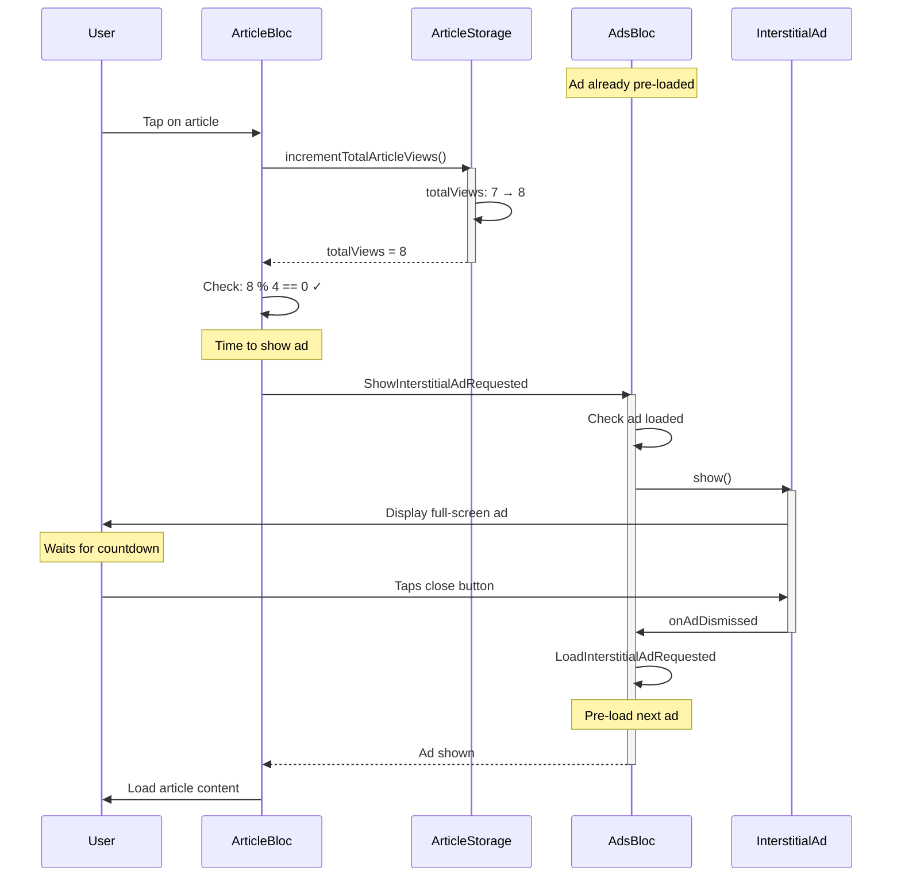
```mermaid
sequenceDiagram
    participant User
    participant ArticleBloc
    participant ArticleStorage
    participant AdsBloc
    participant InterstitialAd

    Note over AdsBloc: Ad already pre-loaded

    User->>ArticleBloc: Tap on article
    ArticleBloc->>ArticleStorage: incrementTotalArticleViews()
    activate ArticleStorage
    ArticleStorage->>ArticleStorage: totalViews: 7 → 8
    ArticleStorage-->>ArticleBloc: totalViews = 8
    deactivate ArticleStorage

    ArticleBloc->>ArticleBloc: Check: 8 % 4 == 0 ✓
    Note over ArticleBloc: Time to show ad

    ArticleBloc->>AdsBloc: ShowInterstitialAdRequested
    activate AdsBloc

    AdsBloc->>AdsBloc: Check ad loaded
    AdsBloc->>InterstitialAd: show()
    activate InterstitialAd

    InterstitialAd->>User: Display full-screen ad
    Note over User: Waits for countdown

    User->>InterstitialAd: Taps close button
    InterstitialAd->>AdsBloc: onAdDismissed
    deactivate InterstitialAd

    AdsBloc->>AdsBloc: LoadInterstitialAdRequested
    Note over AdsBloc: Pre-load next ad
    AdsBloc-->>ArticleBloc: Ad shown
    deactivate AdsBloc

    ArticleBloc->>User: Load article content
```

### Ad Display Configuration

```dart
class FullScreenAdsConfig {
  const FullScreenAdsConfig({
    this.interstitialAdUnitId,
    this.rewardedAdUnitId,
  });

  /// Interstitial Ad Unit ID
  /// Falls back to test ID if not provided
  final String? interstitialAdUnitId;

  /// Rewarded Ad Unit ID
  /// Falls back to test ID if not provided
  final String? rewardedAdUnitId;

  /// Test ad unit IDs
  static String get testInterstitialAdUnitId => Platform.isAndroid
      ? 'ca-app-pub-3940256099942544/1033173712'
      : 'ca-app-pub-3940256099942544/4411468910';

  static String get testRewardedAdUnitId => Platform.isAndroid
      ? 'ca-app-pub-3940256099942544/5224354917'
      : 'ca-app-pub-3940256099942544/1712485313';
}
```

## Rewarded Ad Flow

### Unlocking Article with Rewarded Ad

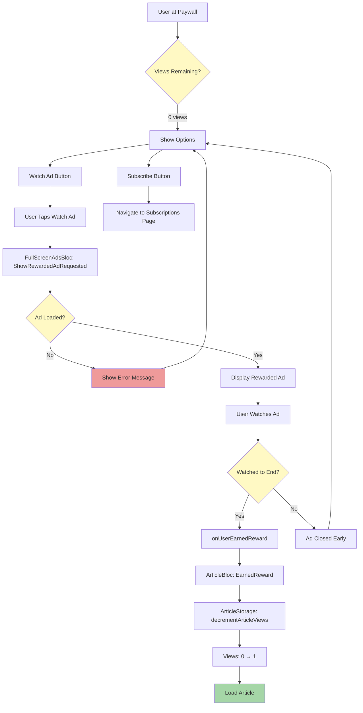
```mermaid
flowchart TD
    A[User at Paywall] --> B{Views Remaining?}
    B -->|0 views| C[Show Options]
    C --> D[Subscribe Button]
    C --> E[Watch Ad Button]

    E --> F[User Taps Watch Ad]
    F --> G[FullScreenAdsBloc: ShowRewardedAdRequested]

    G --> H{Ad Loaded?}
    H -->|No| I[Show Error Message]
    H -->|Yes| J[Display Rewarded Ad]

    I --> C

    J --> K[User Watches Ad]
    K --> L{Watched to End?}

    L -->|Yes| M[onUserEarnedReward]
    L -->|No| N[Ad Closed Early]

    M --> O[ArticleBloc: EarnedReward]
    O --> P[ArticleStorage: decrementArticleViews]
    P --> Q[Views: 0 → 1]
    Q --> R[Load Article]

    N --> C

    D --> S[Navigate to Subscriptions Page]

    style B fill:#fff9c4
    style H fill:#fff9c4
    style L fill:#fff9c4
    style R fill:#a5d6a7
    style I fill:#ef9a9a
```

### Rewarded Ad Callbacks

```dart
void _loadRewardedAd() {
  RewardedAd.load(
    adUnitId: config.rewardedAdUnitId ??
              FullScreenAdsConfig.testRewardedAdUnitId,
    request: const AdRequest(),
    rewardedAdLoadCallback: RewardedAdLoadCallback(
      onAdLoaded: (ad) {
        _rewardedAd = ad;

        // Set callbacks
        ad.fullScreenContentCallback = FullScreenContentCallback(
          onAdDismissedFullScreenContent: (ad) {
            ad.dispose();
            // Pre-load next ad
            add(const LoadRewardedAdRequested());
          },
          onAdFailedToShowFullScreenContent: (ad, error) {
            ad.dispose();
            // Handle error
          },
        );

        emit(state.copyWith(
          rewardedStatus: RewardedAdStatus.loaded,
        ));
      },
      onAdFailedToLoad: (error) {
        // Retry logic
      },
    ),
  );
}

void _showRewardedAd() {
  if (_rewardedAd == null) return;

  _rewardedAd!.show(
    onUserEarnedReward: (ad, reward) {
      // User watched full ad
      add(EarnedReward(reward: reward));
    },
  );
}
```

## Ad Consent Management

### GDPR/CCPA Compliance

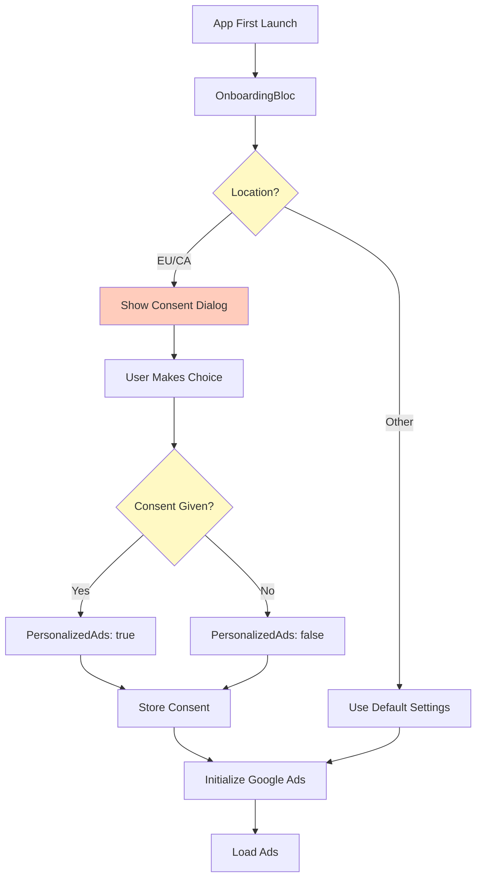
```mermaid
graph TB
    A[App First Launch] --> B[OnboardingBloc]
    B --> C{Location?}

    C -->|EU/CA| D[Show Consent Dialog]
    C -->|Other| E[Use Default Settings]

    D --> F[User Makes Choice]
    F --> G{Consent Given?}

    G -->|Yes| H[PersonalizedAds: true]
    G -->|No| I[PersonalizedAds: false]

    H --> J[Store Consent]
    I --> J

    J --> K[Initialize Google Ads]
    E --> K

    K --> L[Load Ads]

    style C fill:#fff9c4
    style G fill:#fff9c4
    style D fill:#ffccbc
```

### AdsConsentClient

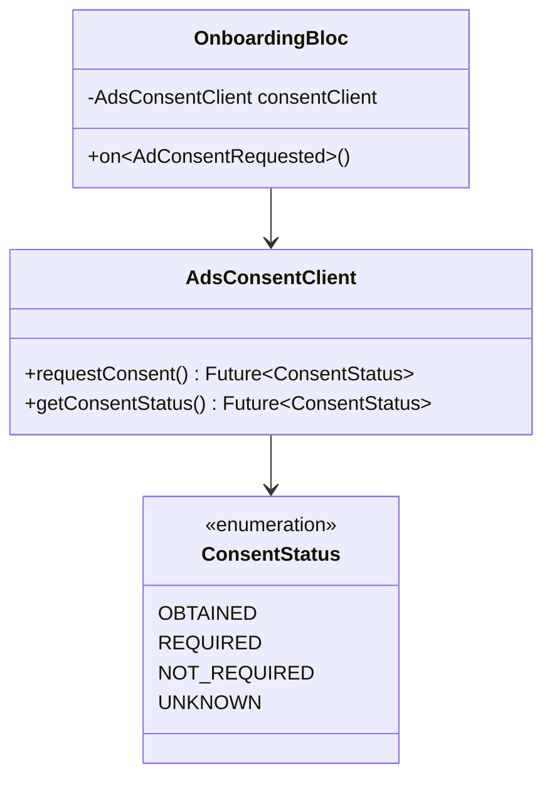
```mermaid
classDiagram
    class AdsConsentClient {
        +requestConsent() Future~ConsentStatus~
        +getConsentStatus() Future~ConsentStatus~
    }

    class ConsentStatus {
        <<enumeration>>
        OBTAINED
        REQUIRED
        NOT_REQUIRED
        UNKNOWN
    }

    class OnboardingBloc {
        -AdsConsentClient consentClient
        +on~AdConsentRequested~()
    }

    OnboardingBloc --> AdsConsentClient
    AdsConsentClient --> ConsentStatus
```

### Consent Flow

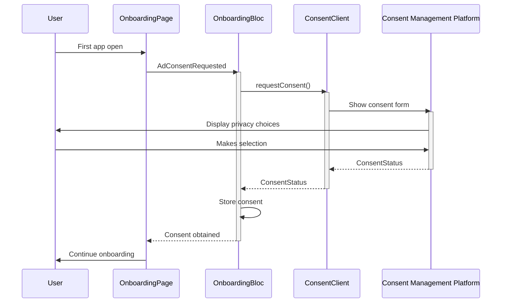
```mermaid
sequenceDiagram
    participant User
    participant OnboardingPage
    participant OnboardingBloc
    participant ConsentClient
    participant CMP as Consent Management Platform

    User->>OnboardingPage: First app open
    OnboardingPage->>OnboardingBloc: AdConsentRequested
    activate OnboardingBloc

    OnboardingBloc->>ConsentClient: requestConsent()
    activate ConsentClient

    ConsentClient->>CMP: Show consent form
    activate CMP
    CMP->>User: Display privacy choices
    User->>CMP: Makes selection
    CMP-->>ConsentClient: ConsentStatus
    deactivate CMP

    ConsentClient-->>OnboardingBloc: ConsentStatus
    deactivate ConsentClient

    OnboardingBloc->>OnboardingBloc: Store consent
    OnboardingBloc-->>OnboardingPage: Consent obtained
    deactivate OnboardingBloc

    OnboardingPage->>User: Continue onboarding
```

## Monetization Strategy

### Revenue Streams

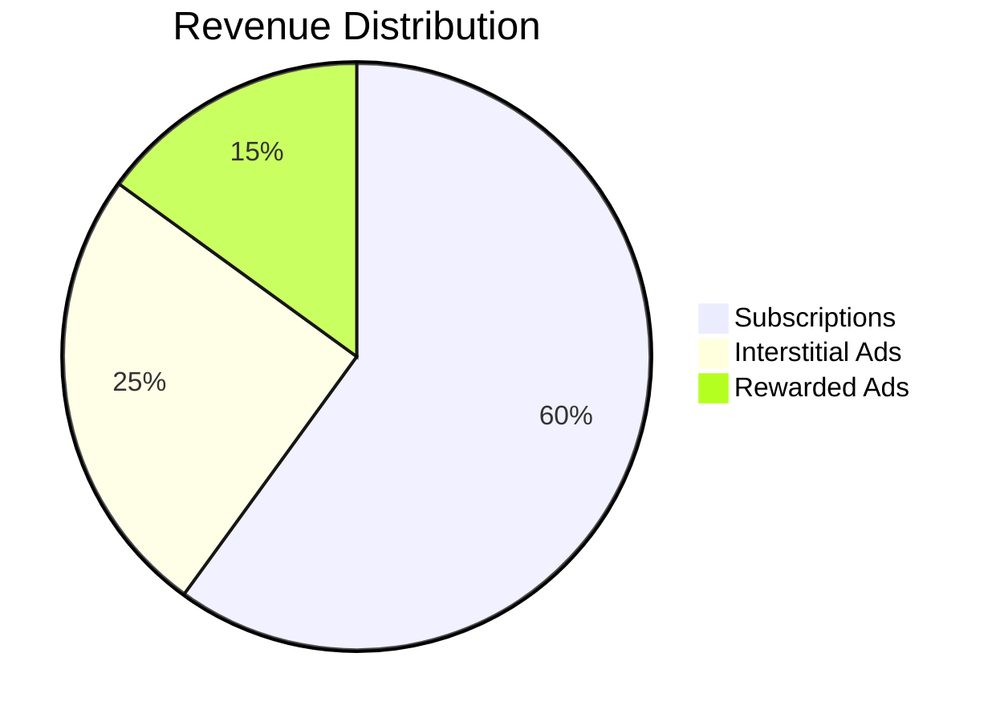
```mermaid
pie title Revenue Distribution
    "Subscriptions" : 60
    "Interstitial Ads" : 25
    "Rewarded Ads" : 15
```

### Article View Limits

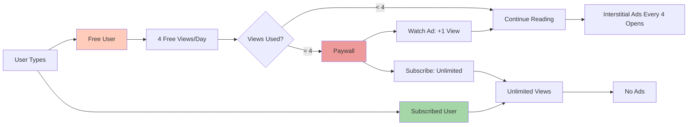
```mermaid
graph LR
    A[User Types] --> B[Free User]
    A --> C[Subscribed User]

    B --> D[4 Free Views/Day]
    C --> E[Unlimited Views]

    D --> F{Views Used?}
    F -->|< 4| G[Continue Reading]
    F -->|= 4| H[Paywall]

    H --> I[Watch Ad: +1 View]
    H --> J[Subscribe: Unlimited]

    I --> G
    J --> E

    E --> K[No Ads]
    G --> L[Interstitial Ads Every 4 Opens]

    style B fill:#ffccbc
    style C fill:#a5d6a7
    style H fill:#ef9a9a
```

### Ad Frequency Configuration

```dart
class ArticleBloc extends HydratedBloc<ArticleEvent, ArticleState> {
  static const int _interstitialFrequency = 4;

  Future<void> _onArticleRequested(
    ArticleRequested event,
    Emitter<ArticleState> emit,
  ) async {
    // Check if user should see interstitial ad
    final totalViews = await _articleRepository.fetchTotalArticleViews();
    final shouldShowAd = totalViews % _interstitialFrequency == 0;

    if (shouldShowAd && !user.isSubscribed) {
      // Request ad display
      _fullScreenAdsBloc.add(const ShowInterstitialAdRequested());
    }

    // Load article...
  }
}
```

## Performance Considerations

### Ad Loading Performance


```mermaid
gantt
    title Ad Loading Timeline (Optimized)
    dateFormat X
    axisFormat %Ss

    section User Experience
    App Launch              :0, 2
    User Browsing           :2, 5
    Open Article            :7, 1
    Display Article         :8, 3

    section Ad System
    Pre-load Interstitial   :0, 3
    Pre-load Rewarded       :0, 4
    Interstitial Ready      :3, 8
    Rewarded Ready          :4, 7
    Show Ad (if needed)     :7, 1
```

### Optimization Strategies

1. **Pre-loading**: Load ads during app initialization
2. **Caching**: Keep loaded ads in memory
3. **Retry Logic**: Exponential backoff prevents spam
4. **Lazy Loading**: Only load when needed
5. **Background Loading**: Don't block UI

## Error Handling

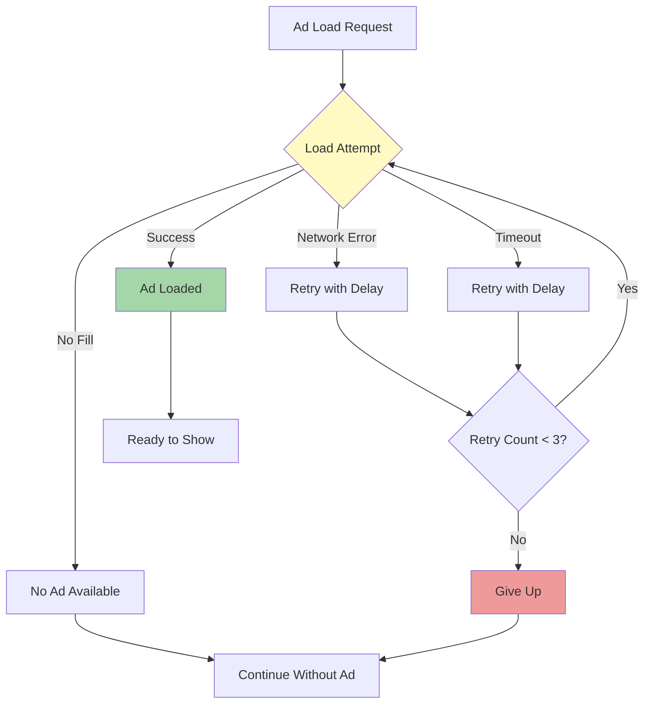
```mermaid
flowchart TD
    A[Ad Load Request] --> B{Load Attempt}
    B -->|Success| C[Ad Loaded]
    B -->|Network Error| D[Retry with Delay]
    B -->|No Fill| E[No Ad Available]
    B -->|Timeout| F[Retry with Delay]

    D --> G{Retry Count < 3?}
    G -->|Yes| B
    G -->|No| H[Give Up]

    F --> G

    C --> I[Ready to Show]
    E --> J[Continue Without Ad]
    H --> J

    style B fill:#fff9c4
    style C fill:#a5d6a7
    style H fill:#ef9a9a
```

## Testing Ad Implementation

### Test Ad Units

```dart
// Development: Use test ad units
const testConfig = FullScreenAdsConfig(
  interstitialAdUnitId: 'ca-app-pub-3940256099942544/1033173712', // Android
  rewardedAdUnitId: 'ca-app-pub-3940256099942544/5224354917',     // Android
);

// Production: Use real ad units
const prodConfig = FullScreenAdsConfig(
  interstitialAdUnitId: 'ca-app-pub-XXXXXXXXXXXXXXXX/YYYYYYYYYY',
  rewardedAdUnitId: 'ca-app-pub-XXXXXXXXXXXXXXXX/ZZZZZZZZZZ',
);
```

## Summary

The ad implementation provides:

- **Two ad types**: Interstitial (monetization) and rewarded (user choice)
- **Smart frequency**: Interstitial every 4 article opens
- **Pre-loading**: Ads ready before user needs them
- **Retry logic**: Exponential backoff for reliability
- **Consent management**: GDPR/CCPA compliant
- **User-friendly**: Rewarded ads give users control
- **Performance optimized**: Background loading, caching
- **Error resilient**: Graceful fallbacks
- **Subscription integration**: No ads for paid users
- **Analytics tracking**: Monitor ad performance

This architecture balances monetization with user experience, providing value to both free and subscribed users while generating revenue through strategically placed advertisements.
