# Main Feature Flows

## Table of Contents
- [Overview](#overview)
- [News Feed](#news-feed)
- [Article Reading](#article-reading)
- [Search Functionality](#search-functionality)
- [Subscription Management](#subscription-management)
- [Push Notifications](#push-notifications)
- [User Profile](#user-profile)
- [Newsletter](#newsletter)
- [Complete User Journeys](#complete-user-journeys)

## Overview

This document details the main feature flows of the Flutter News App, showing how users interact with key functionality through sequence diagrams and flowcharts.

**Main Features:**
1. News Feed - Browse articles by category
2. Article Reading - View content with limits
3. Search - Find articles by keywords
4. Subscriptions - Manage in-app purchases
5. Push Notifications - Manage preferences
6. User Profile - Account management
7. Newsletter - Email subscription

## News Feed

### Feed Loading Flow

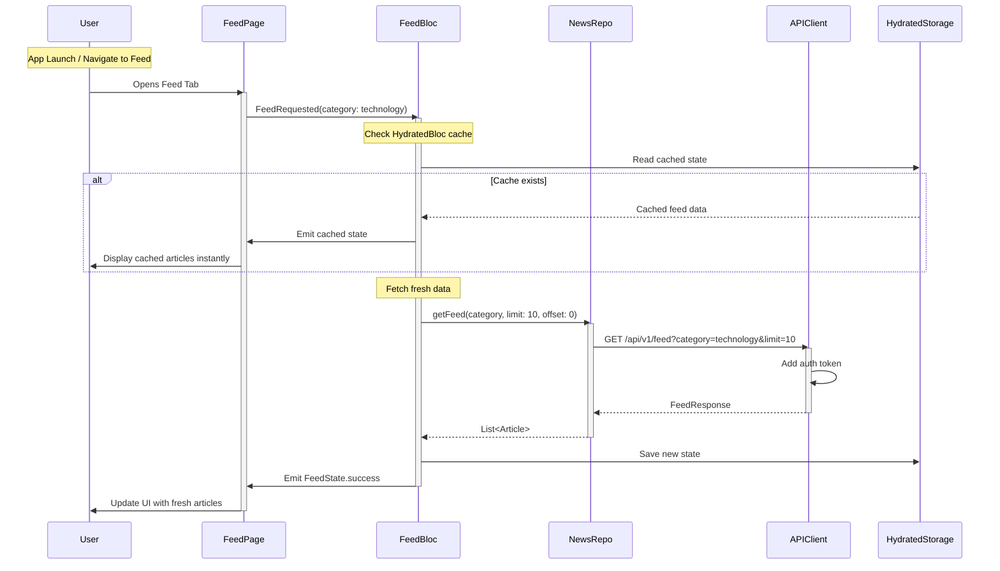
```mermaid
sequenceDiagram
    participant User
    participant FeedPage
    participant FeedBloc
    participant NewsRepo
    participant APIClient
    participant HydratedStorage

    Note over User: App Launch / Navigate to Feed

    User->>FeedPage: Opens Feed Tab
    activate FeedPage

    FeedPage->>FeedBloc: FeedRequested(category: technology)
    activate FeedBloc

    Note over FeedBloc: Check HydratedBloc cache
    FeedBloc->>HydratedStorage: Read cached state
    alt Cache exists
        HydratedStorage-->>FeedBloc: Cached feed data
        FeedBloc->>FeedPage: Emit cached state
        FeedPage->>User: Display cached articles instantly
    end

    Note over FeedBloc: Fetch fresh data
    FeedBloc->>NewsRepo: getFeed(category, limit: 10, offset: 0)
    activate NewsRepo

    NewsRepo->>APIClient: GET /api/v1/feed?category=technology&limit=10
    activate APIClient
    APIClient->>APIClient: Add auth token
    APIClient-->>NewsRepo: FeedResponse
    deactivate APIClient

    NewsRepo-->>FeedBloc: List<Article>
    deactivate NewsRepo

    FeedBloc->>HydratedStorage: Save new state
    FeedBloc->>FeedPage: Emit FeedState.success
    deactivate FeedBloc

    FeedPage->>User: Update UI with fresh articles
    deactivate FeedPage
```

### Feed Pagination

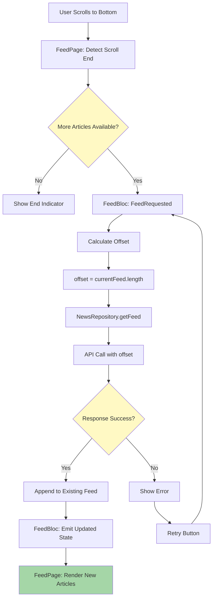
```mermaid
flowchart TD
    A[User Scrolls to Bottom] --> B[FeedPage: Detect Scroll End]
    B --> C{More Articles Available?}

    C -->|No| D[Show End Indicator]
    C -->|Yes| E[FeedBloc: FeedRequested]

    E --> F[Calculate Offset]
    F --> G[offset = currentFeed.length]

    G --> H[NewsRepository.getFeed]
    H --> I[API Call with offset]

    I --> J{Response Success?}
    J -->|No| K[Show Error]
    J -->|Yes| L[Append to Existing Feed]

    L --> M[FeedBloc: Emit Updated State]
    M --> N[FeedPage: Render New Articles]

    K --> O[Retry Button]
    O --> E

    style C fill:#fff9c4
    style J fill:#fff9c4
    style N fill:#a5d6a7
```

### Category Switching

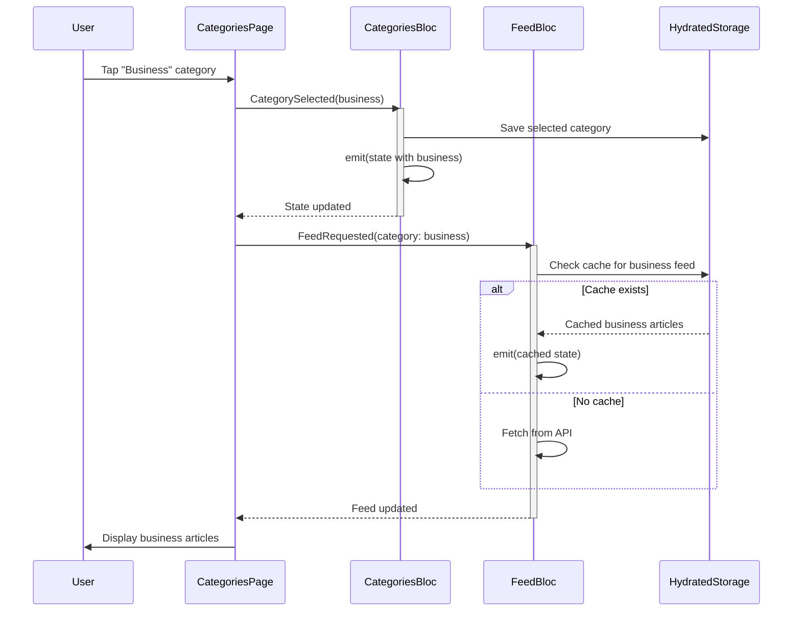
```mermaid
sequenceDiagram
    participant User
    participant CategoriesPage
    participant CategoriesBloc
    participant FeedBloc
    participant HydratedStorage

    User->>CategoriesPage: Tap "Business" category
    CategoriesPage->>CategoriesBloc: CategorySelected(business)
    activate CategoriesBloc

    CategoriesBloc->>HydratedStorage: Save selected category
    CategoriesBloc->>CategoriesBloc: emit(state with business)
    CategoriesBloc-->>CategoriesPage: State updated
    deactivate CategoriesBloc

    CategoriesPage->>FeedBloc: FeedRequested(category: business)
    activate FeedBloc

    FeedBloc->>HydratedStorage: Check cache for business feed
    alt Cache exists
        HydratedStorage-->>FeedBloc: Cached business articles
        FeedBloc->>FeedBloc: emit(cached state)
    else No cache
        FeedBloc->>FeedBloc: Fetch from API
    end

    FeedBloc-->>CategoriesPage: Feed updated
    deactivate FeedBloc

    CategoriesPage->>User: Display business articles
```

### Pull-to-Refresh

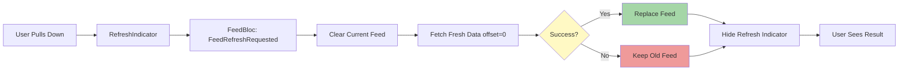
```mermaid
flowchart LR
    A[User Pulls Down] --> B[RefreshIndicator]
    B --> C[FeedBloc: FeedRefreshRequested]
    C --> D[Clear Current Feed]
    D --> E[Fetch Fresh Data offset=0]
    E --> F{Success?}
    F -->|Yes| G[Replace Feed]
    F -->|No| H[Keep Old Feed]
    G --> I[Hide Refresh Indicator]
    H --> I
    I --> J[User Sees Result]

    style F fill:#fff9c4
    style G fill:#a5d6a7
    style H fill:#ef9a9a
```

## Article Reading

### Complete Article Reading Flow

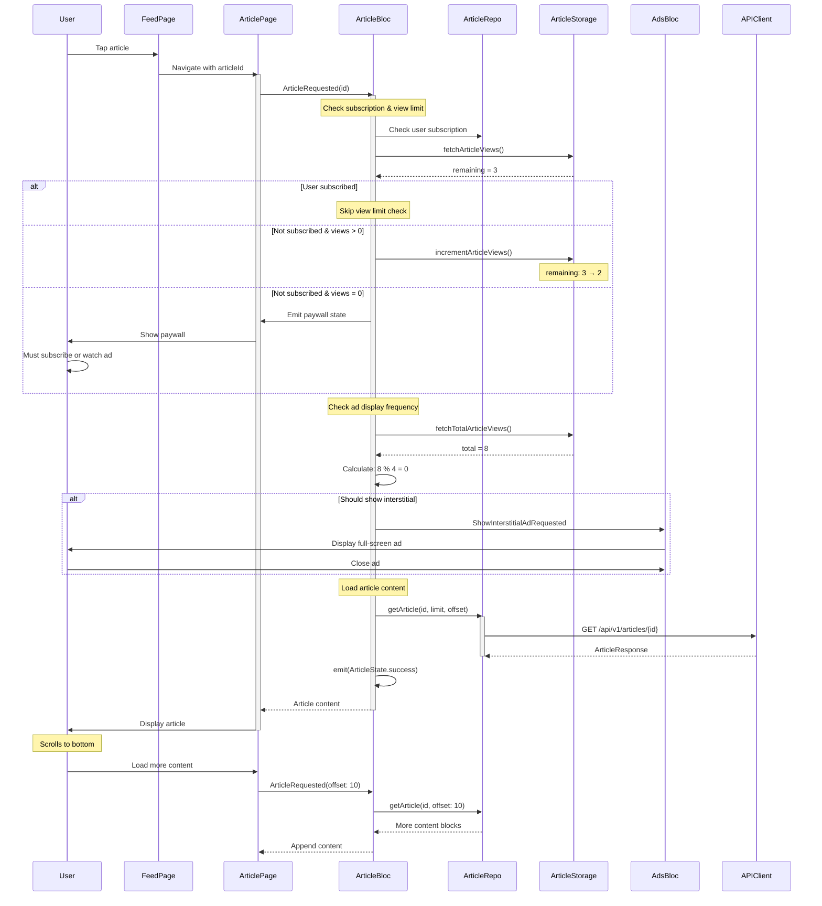
```mermaid
sequenceDiagram
    participant User
    participant FeedPage
    participant ArticlePage
    participant ArticleBloc
    participant ArticleRepo
    participant ArticleStorage
    participant AdsBloc
    participant APIClient

    User->>FeedPage: Tap article
    FeedPage->>ArticlePage: Navigate with articleId
    activate ArticlePage

    ArticlePage->>ArticleBloc: ArticleRequested(id)
    activate ArticleBloc

    Note over ArticleBloc: Check subscription & view limit
    ArticleBloc->>ArticleRepo: Check user subscription
    ArticleBloc->>ArticleStorage: fetchArticleViews()
    ArticleStorage-->>ArticleBloc: remaining = 3

    alt User subscribed
        Note over ArticleBloc: Skip view limit check
    else Not subscribed & views > 0
        ArticleBloc->>ArticleStorage: incrementArticleViews()
        Note over ArticleStorage: remaining: 3 → 2
    else Not subscribed & views = 0
        ArticleBloc->>ArticlePage: Emit paywall state
        ArticlePage->>User: Show paywall
        User->>User: Must subscribe or watch ad
    end

    Note over ArticleBloc: Check ad display frequency
    ArticleBloc->>ArticleStorage: fetchTotalArticleViews()
    ArticleStorage-->>ArticleBloc: total = 8
    ArticleBloc->>ArticleBloc: Calculate: 8 % 4 = 0

    alt Should show interstitial
        ArticleBloc->>AdsBloc: ShowInterstitialAdRequested
        AdsBloc->>User: Display full-screen ad
        User->>AdsBloc: Close ad
    end

    Note over ArticleBloc: Load article content
    ArticleBloc->>ArticleRepo: getArticle(id, limit, offset)
    activate ArticleRepo
    ArticleRepo->>APIClient: GET /api/v1/articles/{id}
    APIClient-->>ArticleRepo: ArticleResponse
    deactivate ArticleRepo

    ArticleBloc->>ArticleBloc: emit(ArticleState.success)
    ArticleBloc-->>ArticlePage: Article content
    deactivate ArticleBloc

    ArticlePage->>User: Display article
    deactivate ArticlePage

    Note over User: Scrolls to bottom
    User->>ArticlePage: Load more content
    ArticlePage->>ArticleBloc: ArticleRequested(offset: 10)
    ArticleBloc->>ArticleRepo: getArticle(id, offset: 10)
    ArticleRepo-->>ArticleBloc: More content blocks
    ArticleBloc-->>ArticlePage: Append content
```

### Article Content Pagination

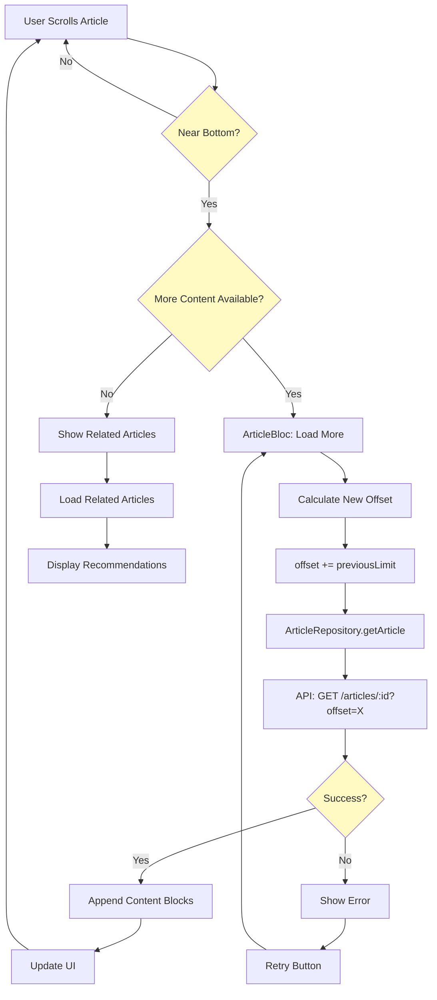
```mermaid
flowchart TD
    A[User Scrolls Article] --> B{Near Bottom?}
    B -->|No| A
    B -->|Yes| C{More Content Available?}

    C -->|No| D[Show Related Articles]
    C -->|Yes| E[ArticleBloc: Load More]

    E --> F[Calculate New Offset]
    F --> G[offset += previousLimit]

    G --> H[ArticleRepository.getArticle]
    H --> I[API: GET /articles/:id?offset=X]

    I --> J{Success?}
    J -->|Yes| K[Append Content Blocks]
    J -->|No| L[Show Error]

    K --> M[Update UI]
    M --> A

    L --> N[Retry Button]
    N --> E

    D --> O[Load Related Articles]
    O --> P[Display Recommendations]

    style B fill:#fff9c4
    style C fill:#fff9c4
    style J fill:#fff9c4
```

### Paywall Flow with Rewarded Ad

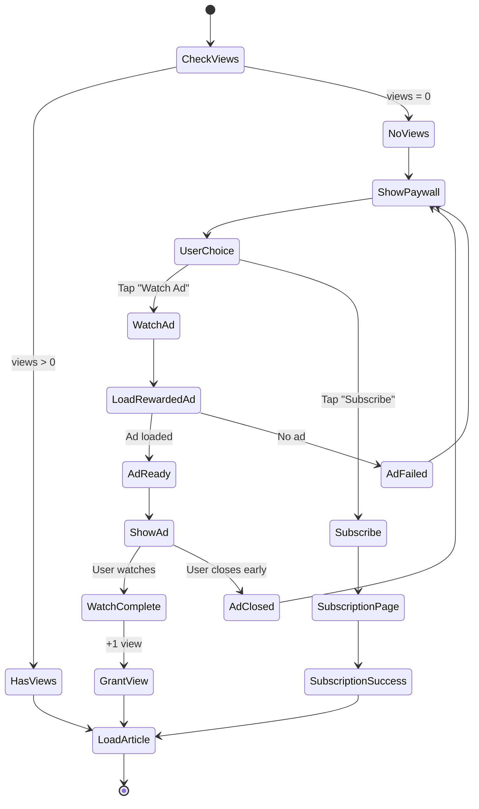
```mermaid
stateDiagram-v2
    [*] --> CheckViews

    CheckViews --> HasViews: views > 0
    CheckViews --> NoViews: views = 0

    HasViews --> LoadArticle
    NoViews --> ShowPaywall

    ShowPaywall --> UserChoice
    UserChoice --> WatchAd: Tap "Watch Ad"
    UserChoice --> Subscribe: Tap "Subscribe"

    WatchAd --> LoadRewardedAd
    LoadRewardedAd --> AdReady: Ad loaded
    LoadRewardedAd --> AdFailed: No ad

    AdReady --> ShowAd
    ShowAd --> WatchComplete: User watches
    ShowAd --> AdClosed: User closes early

    WatchComplete --> GrantView: +1 view
    GrantView --> LoadArticle

    AdClosed --> ShowPaywall
    AdFailed --> ShowPaywall

    Subscribe --> SubscriptionPage
    SubscriptionPage --> SubscriptionSuccess
    SubscriptionSuccess --> LoadArticle

    LoadArticle --> [*]
```

## Search Functionality

### Search Flow

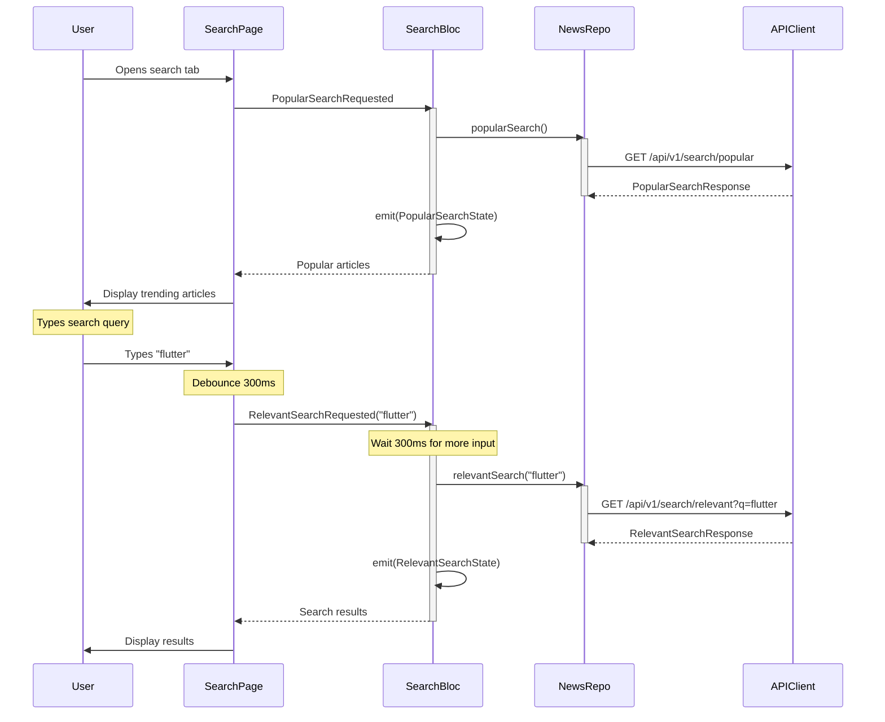
```mermaid
sequenceDiagram
    participant User
    participant SearchPage
    participant SearchBloc
    participant NewsRepo
    participant APIClient

    User->>SearchPage: Opens search tab
    SearchPage->>SearchBloc: PopularSearchRequested
    activate SearchBloc

    SearchBloc->>NewsRepo: popularSearch()
    activate NewsRepo
    NewsRepo->>APIClient: GET /api/v1/search/popular
    APIClient-->>NewsRepo: PopularSearchResponse
    deactivate NewsRepo

    SearchBloc->>SearchBloc: emit(PopularSearchState)
    SearchBloc-->>SearchPage: Popular articles
    deactivate SearchBloc

    SearchPage->>User: Display trending articles

    Note over User: Types search query

    User->>SearchPage: Types "flutter"
    Note over SearchPage: Debounce 300ms
    SearchPage->>SearchBloc: RelevantSearchRequested("flutter")
    activate SearchBloc

    Note over SearchBloc: Wait 300ms for more input

    SearchBloc->>NewsRepo: relevantSearch("flutter")
    activate NewsRepo
    NewsRepo->>APIClient: GET /api/v1/search/relevant?q=flutter
    APIClient-->>NewsRepo: RelevantSearchResponse
    deactivate NewsRepo

    SearchBloc->>SearchBloc: emit(RelevantSearchState)
    SearchBloc-->>SearchPage: Search results
    deactivate SearchBloc

    SearchPage->>User: Display results
```

### Search Debouncing

```mermaid
gantt
    title Search Debouncing (300ms)
    dateFormat X
    axisFormat %Lms

    section User Input
    Type "f"           :0, 100
    Type "l"           :100, 100
    Type "u"           :200, 100
    Type "t"           :300, 100

    section Debounce Window
    Debounce "f"       :100, 300
    Debounce "fl"      :200, 300
    Debounce "flu"     :300, 300
    Debounce "flut"    :400, 300

    section API Call
    Search "flut"      :700, 200
```

### Search State Machine

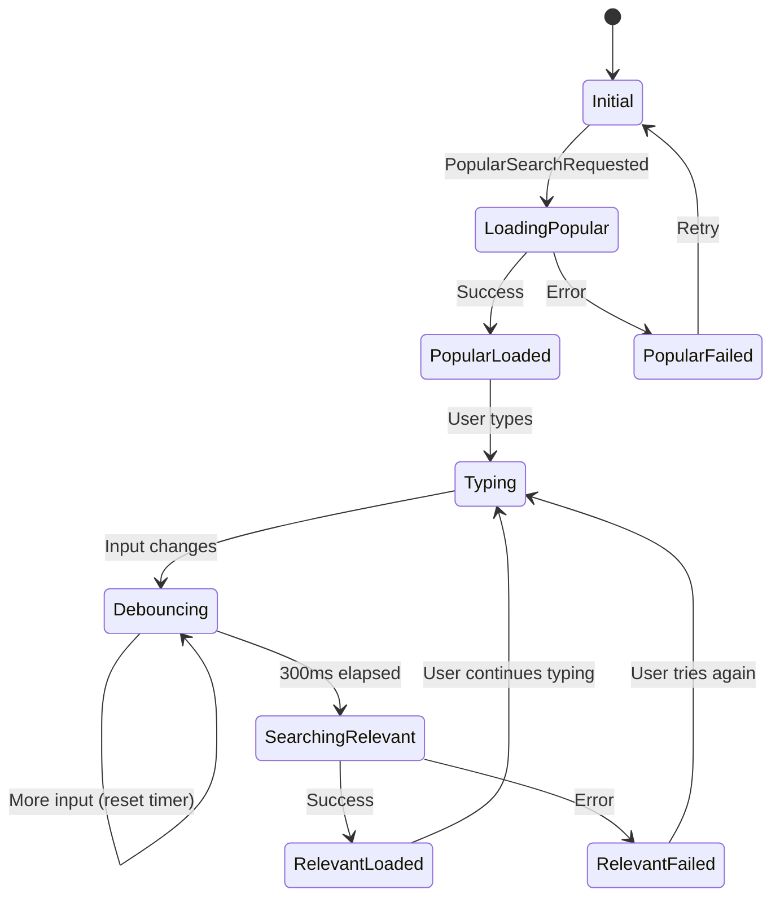
```mermaid
stateDiagram-v2
    [*] --> Initial

    Initial --> LoadingPopular: PopularSearchRequested
    LoadingPopular --> PopularLoaded: Success
    LoadingPopular --> PopularFailed: Error

    PopularLoaded --> Typing: User types
    Typing --> Debouncing: Input changes
    Debouncing --> Debouncing: More input (reset timer)
    Debouncing --> SearchingRelevant: 300ms elapsed

    SearchingRelevant --> RelevantLoaded: Success
    SearchingRelevant --> RelevantFailed: Error

    RelevantLoaded --> Typing: User continues typing
    RelevantFailed --> Typing: User tries again

    PopularFailed --> Initial: Retry
```

## Subscription Management

### Purchase Flow

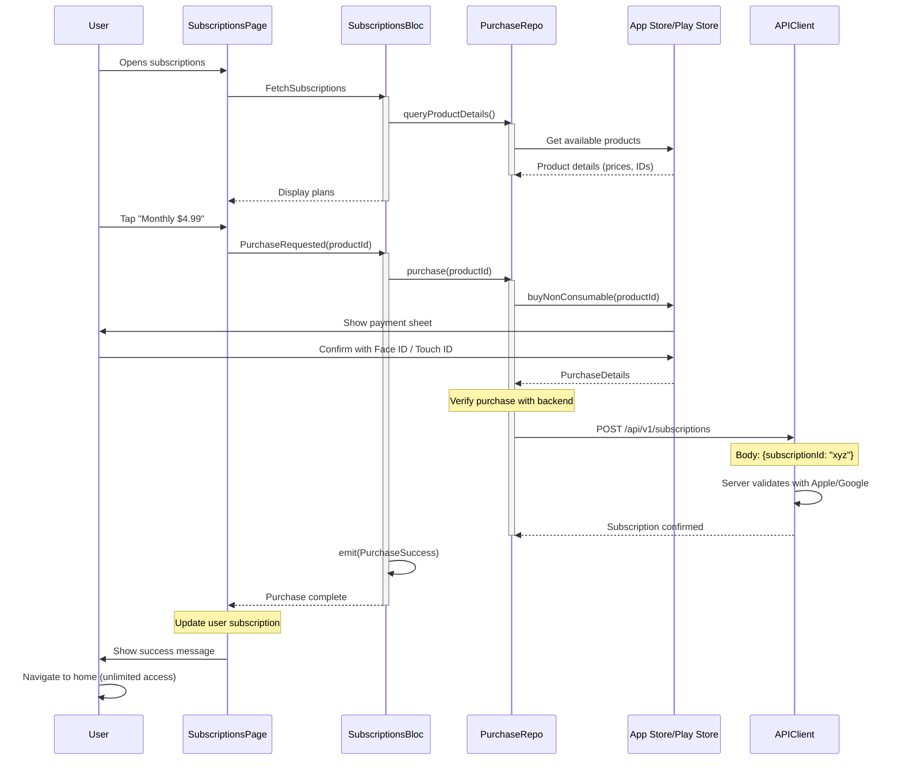
```mermaid
sequenceDiagram
    participant User
    participant SubscriptionsPage
    participant SubscriptionsBloc
    participant PurchaseRepo
    participant StoreKit as App Store/Play Store
    participant APIClient

    User->>SubscriptionsPage: Opens subscriptions
    SubscriptionsPage->>SubscriptionsBloc: FetchSubscriptions
    activate SubscriptionsBloc

    SubscriptionsBloc->>PurchaseRepo: queryProductDetails()
    activate PurchaseRepo
    PurchaseRepo->>StoreKit: Get available products
    StoreKit-->>PurchaseRepo: Product details (prices, IDs)
    deactivate PurchaseRepo

    SubscriptionsBloc-->>SubscriptionsPage: Display plans
    deactivate SubscriptionsBloc

    User->>SubscriptionsPage: Tap "Monthly $4.99"
    SubscriptionsPage->>SubscriptionsBloc: PurchaseRequested(productId)
    activate SubscriptionsBloc

    SubscriptionsBloc->>PurchaseRepo: purchase(productId)
    activate PurchaseRepo

    PurchaseRepo->>StoreKit: buyNonConsumable(productId)
    StoreKit->>User: Show payment sheet
    User->>StoreKit: Confirm with Face ID / Touch ID
    StoreKit-->>PurchaseRepo: PurchaseDetails

    Note over PurchaseRepo: Verify purchase with backend

    PurchaseRepo->>APIClient: POST /api/v1/subscriptions
    Note over APIClient: Body: {subscriptionId: "xyz"}
    APIClient->>APIClient: Server validates with Apple/Google
    APIClient-->>PurchaseRepo: Subscription confirmed
    deactivate PurchaseRepo

    SubscriptionsBloc->>SubscriptionsBloc: emit(PurchaseSuccess)
    SubscriptionsBloc-->>SubscriptionsPage: Purchase complete
    deactivate SubscriptionsBloc

    Note over SubscriptionsPage: Update user subscription
    SubscriptionsPage->>User: Show success message
    User->>User: Navigate to home (unlimited access)
```

### Subscription State Flow

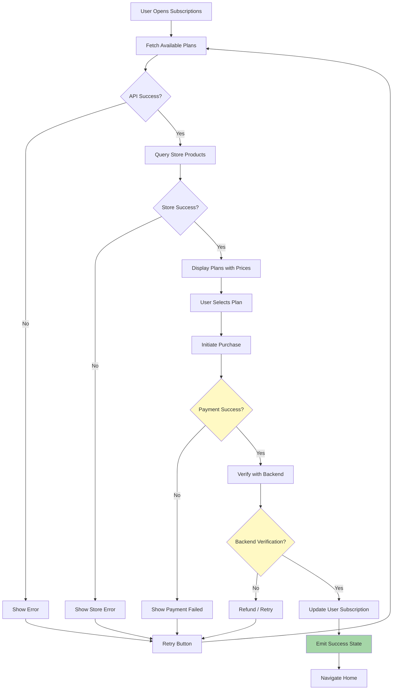
```mermaid
flowchart TD
    A[User Opens Subscriptions] --> B[Fetch Available Plans]
    B --> C{API Success?}

    C -->|No| D[Show Error]
    C -->|Yes| E[Query Store Products]

    E --> F{Store Success?}
    F -->|No| G[Show Store Error]
    F -->|Yes| H[Display Plans with Prices]

    H --> I[User Selects Plan]
    I --> J[Initiate Purchase]

    J --> K{Payment Success?}
    K -->|No| L[Show Payment Failed]
    K -->|Yes| M[Verify with Backend]

    M --> N{Backend Verification?}
    N -->|No| O[Refund / Retry]
    N -->|Yes| P[Update User Subscription]

    P --> Q[Emit Success State]
    Q --> R[Navigate Home]

    D --> S[Retry Button]
    G --> S
    L --> S
    O --> S

    S --> B

    style K fill:#fff9c4
    style N fill:#fff9c4
    style Q fill:#a5d6a7
```

### Subscription Benefits Activation

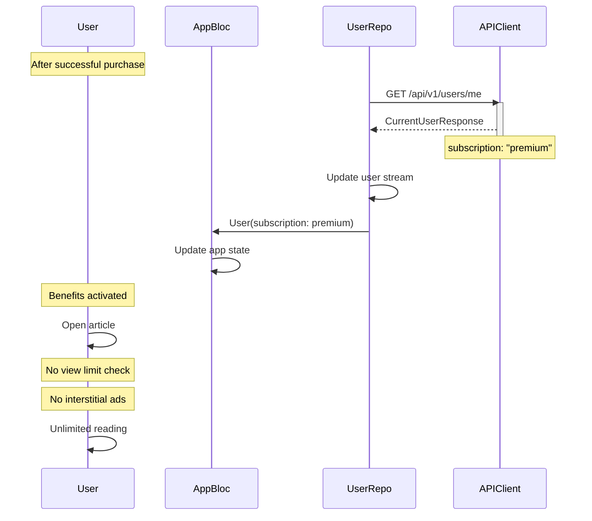
```mermaid
sequenceDiagram
    participant User
    participant AppBloc
    participant UserRepo
    participant APIClient

    Note over User: After successful purchase

    UserRepo->>APIClient: GET /api/v1/users/me
    activate APIClient
    APIClient-->>UserRepo: CurrentUserResponse
    Note over APIClient: subscription: "premium"
    deactivate APIClient

    UserRepo->>UserRepo: Update user stream
    UserRepo->>AppBloc: User(subscription: premium)

    AppBloc->>AppBloc: Update app state

    Note over User: Benefits activated

    User->>User: Open article
    Note over User: No view limit check
    Note over User: No interstitial ads
    User->>User: Unlimited reading
```

## Push Notifications

### Notification Setup Flow

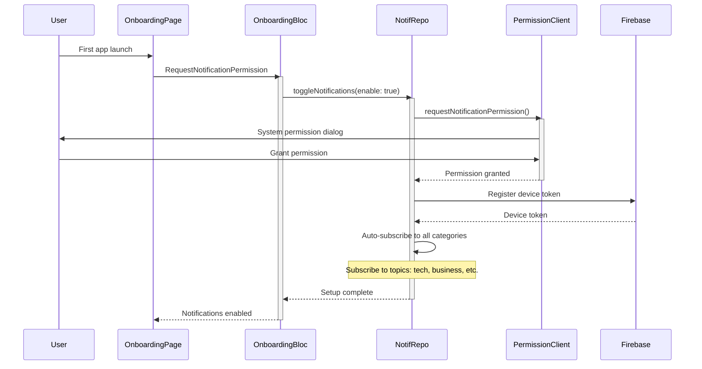
```mermaid
sequenceDiagram
    participant User
    participant OnboardingPage
    participant OnboardingBloc
    participant NotifRepo
    participant PermissionClient
    participant Firebase

    User->>OnboardingPage: First app launch
    OnboardingPage->>OnboardingBloc: RequestNotificationPermission
    activate OnboardingBloc

    OnboardingBloc->>NotifRepo: toggleNotifications(enable: true)
    activate NotifRepo

    NotifRepo->>PermissionClient: requestNotificationPermission()
    activate PermissionClient
    PermissionClient->>User: System permission dialog
    User->>PermissionClient: Grant permission
    PermissionClient-->>NotifRepo: Permission granted
    deactivate PermissionClient

    NotifRepo->>Firebase: Register device token
    Firebase-->>NotifRepo: Device token

    NotifRepo->>NotifRepo: Auto-subscribe to all categories
    Note over NotifRepo: Subscribe to topics: tech, business, etc.

    NotifRepo-->>OnboardingBloc: Setup complete
    deactivate NotifRepo

    OnboardingBloc-->>OnboardingPage: Notifications enabled
    deactivate OnboardingBloc
```

### Category Preference Management

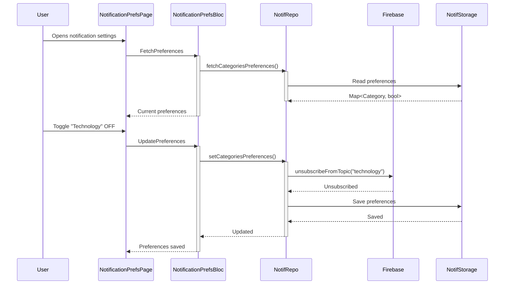
```mermaid
sequenceDiagram
    participant User
    participant NotificationPrefsPage
    participant NotificationPrefsBloc
    participant NotifRepo
    participant Firebase
    participant NotifStorage

    User->>NotificationPrefsPage: Opens notification settings
    NotificationPrefsPage->>NotificationPrefsBloc: FetchPreferences
    activate NotificationPrefsBloc

    NotificationPrefsBloc->>NotifRepo: fetchCategoriesPreferences()
    activate NotifRepo
    NotifRepo->>NotifStorage: Read preferences
    NotifStorage-->>NotifRepo: Map<Category, bool>
    deactivate NotifRepo

    NotificationPrefsBloc-->>NotificationPrefsPage: Current preferences
    deactivate NotificationPrefsBloc

    User->>NotificationPrefsPage: Toggle "Technology" OFF
    NotificationPrefsPage->>NotificationPrefsBloc: UpdatePreferences
    activate NotificationPrefsBloc

    NotificationPrefsBloc->>NotifRepo: setCategoriesPreferences()
    activate NotifRepo

    NotifRepo->>Firebase: unsubscribeFromTopic("technology")
    Firebase-->>NotifRepo: Unsubscribed

    NotifRepo->>NotifStorage: Save preferences
    NotifStorage-->>NotifRepo: Saved

    NotifRepo-->>NotificationPrefsBloc: Updated
    deactivate NotifRepo

    NotificationPrefsBloc-->>NotificationPrefsPage: Preferences saved
    deactivate NotificationPrefsBloc
```

### Topic Subscription Logic

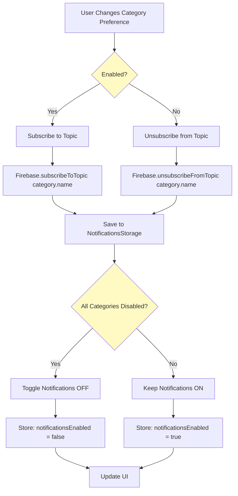
```mermaid
flowchart TD
    A[User Changes Category Preference] --> B{Enabled?}

    B -->|Yes| C[Subscribe to Topic]
    B -->|No| D[Unsubscribe from Topic]

    C --> E[Firebase.subscribeToTopic category.name]
    D --> F[Firebase.unsubscribeFromTopic category.name]

    E --> G[Save to NotificationsStorage]
    F --> G

    G --> H{All Categories Disabled?}
    H -->|Yes| I[Toggle Notifications OFF]
    H -->|No| J[Keep Notifications ON]

    I --> K[Store: notificationsEnabled = false]
    J --> L[Store: notificationsEnabled = true]

    K --> M[Update UI]
    L --> M

    style B fill:#fff9c4
    style H fill:#fff9c4
```

## User Profile

### Profile Page Flow

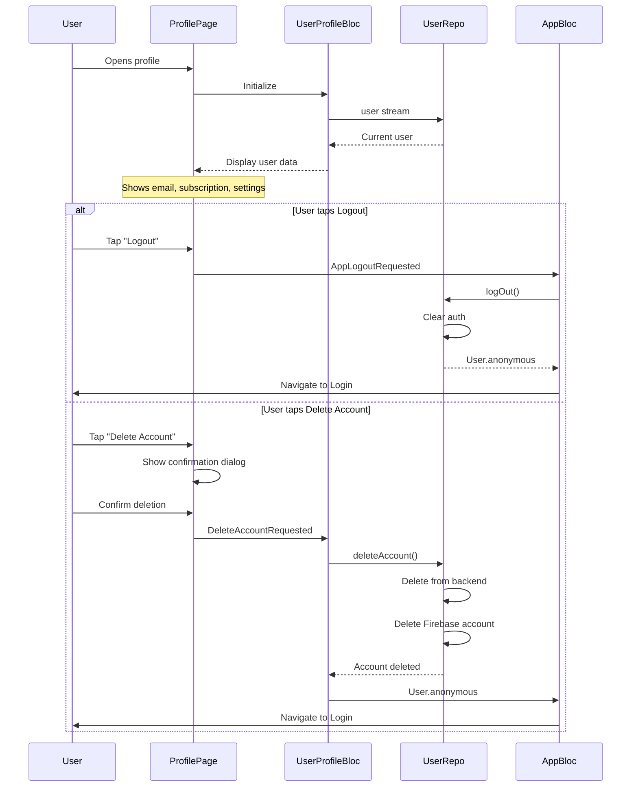
```mermaid
sequenceDiagram
    participant User
    participant ProfilePage
    participant UserProfileBloc
    participant UserRepo
    participant AppBloc

    User->>ProfilePage: Opens profile
    ProfilePage->>UserProfileBloc: Initialize
    UserProfileBloc->>UserRepo: user stream
    UserRepo-->>UserProfileBloc: Current user
    UserProfileBloc-->>ProfilePage: Display user data

    Note over ProfilePage: Shows email, subscription, settings

    alt User taps Logout
        User->>ProfilePage: Tap "Logout"
        ProfilePage->>AppBloc: AppLogoutRequested
        AppBloc->>UserRepo: logOut()
        UserRepo->>UserRepo: Clear auth
        UserRepo-->>AppBloc: User.anonymous
        AppBloc->>User: Navigate to Login
    else User taps Delete Account
        User->>ProfilePage: Tap "Delete Account"
        ProfilePage->>ProfilePage: Show confirmation dialog
        User->>ProfilePage: Confirm deletion
        ProfilePage->>UserProfileBloc: DeleteAccountRequested
        UserProfileBloc->>UserRepo: deleteAccount()
        UserRepo->>UserRepo: Delete from backend
        UserRepo->>UserRepo: Delete Firebase account
        UserRepo-->>UserProfileBloc: Account deleted
        UserProfileBloc->>AppBloc: User.anonymous
        AppBloc->>User: Navigate to Login
    end
```

### Account Deletion Confirmation

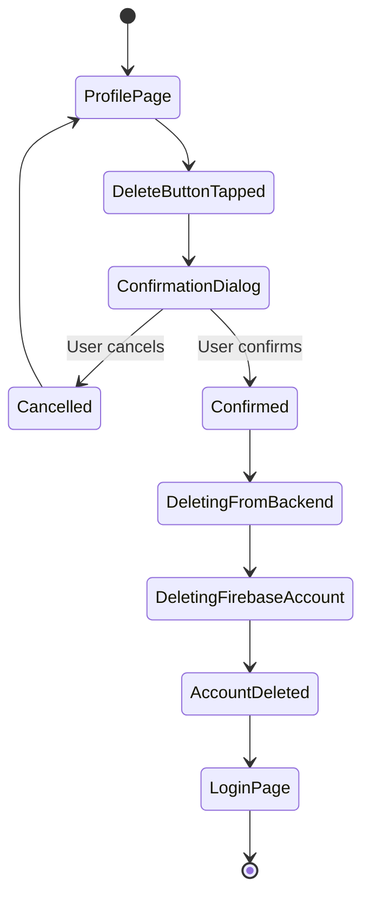
```mermaid
stateDiagram-v2
    [*] --> ProfilePage

    ProfilePage --> DeleteButtonTapped
    DeleteButtonTapped --> ConfirmationDialog

    ConfirmationDialog --> Cancelled: User cancels
    ConfirmationDialog --> Confirmed: User confirms

    Cancelled --> ProfilePage

    Confirmed --> DeletingFromBackend
    DeletingFromBackend --> DeletingFirebaseAccount
    DeletingFirebaseAccount --> AccountDeleted

    AccountDeleted --> LoginPage
    LoginPage --> [*]
```

## Newsletter

### Newsletter Subscription Flow

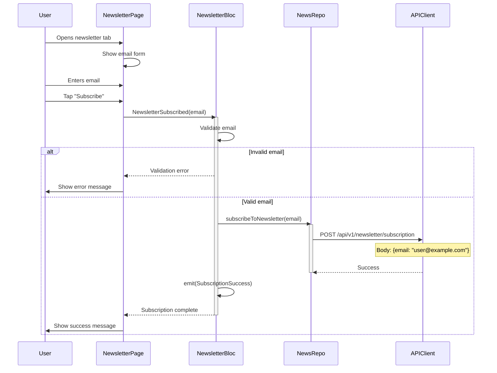
```mermaid
sequenceDiagram
    participant User
    participant NewsletterPage
    participant NewsletterBloc
    participant NewsRepo
    participant APIClient

    User->>NewsletterPage: Opens newsletter tab
    NewsletterPage->>NewsletterPage: Show email form

    User->>NewsletterPage: Enters email
    User->>NewsletterPage: Tap "Subscribe"

    NewsletterPage->>NewsletterBloc: NewsletterSubscribed(email)
    activate NewsletterBloc

    NewsletterBloc->>NewsletterBloc: Validate email
    alt Invalid email
        NewsletterBloc-->>NewsletterPage: Validation error
        NewsletterPage->>User: Show error message
    else Valid email
        NewsletterBloc->>NewsRepo: subscribeToNewsletter(email)
        activate NewsRepo

        NewsRepo->>APIClient: POST /api/v1/newsletter/subscription
        Note over APIClient: Body: {email: "user@example.com"}

        APIClient-->>NewsRepo: Success
        deactivate NewsRepo

        NewsletterBloc->>NewsletterBloc: emit(SubscriptionSuccess)
        NewsletterBloc-->>NewsletterPage: Subscription complete
        deactivate NewsletterBloc

        NewsletterPage->>User: Show success message
    end
```

### Newsletter State Machine

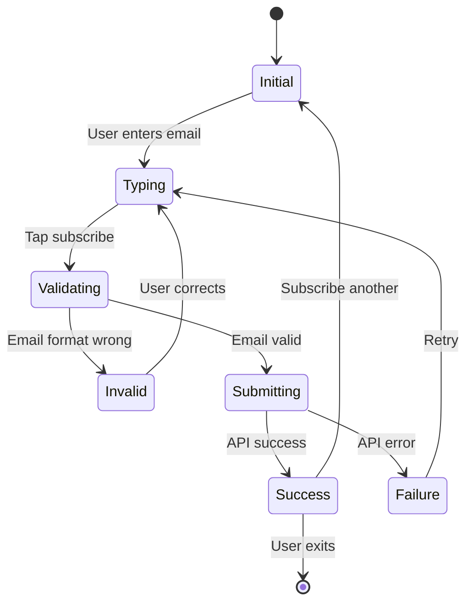
```mermaid
stateDiagram-v2
    [*] --> Initial

    Initial --> Typing: User enters email
    Typing --> Validating: Tap subscribe

    Validating --> Invalid: Email format wrong
    Validating --> Submitting: Email valid

    Invalid --> Typing: User corrects

    Submitting --> Success: API success
    Submitting --> Failure: API error

    Success --> Initial: Subscribe another
    Failure --> Typing: Retry

    Success --> [*]: User exits
```

## Complete User Journeys

### First-Time User Journey

```mermaid
flowchart TD
    A[Install App] --> B[App Launch]
    B --> C[OnboardingPage]

    C --> D[Request Ad Consent]
    D --> E{Consent Given?}
    E -->|Yes| F[Enable Personalized Ads]
    E -->|No| G[Use Generic Ads]

    F --> H[Request Notification Permission]
    G --> H

    H --> I{Permission Granted?}
    I -->|Yes| J[Subscribe to All Categories]
    I -->|No| K[Skip Notifications]

    J --> L[Complete Onboarding]
    K --> L

    L --> M[Navigate to HomePage]
    M --> N[Load News Feed]
    N --> O[Display Articles]

    O --> P[User Browses]
    P --> Q{Action}

    Q -->|Tap Article| R[Open Article]
    Q -->|Search| S[Open Search]
    Q -->|Profile| T[Open Profile]

    R --> U{View Limit?}
    U -->|Views Available| V[Display Article]
    U -->|No Views| W[Show Paywall]

    W --> X{User Choice}
    X -->|Watch Ad| Y[Grant +1 View]
    X -->|Subscribe| Z[Purchase Subscription]

    Y --> V
    Z --> AA[Unlimited Access]
    AA --> V

    style E fill:#fff9c4
    style I fill:#fff9c4
    style U fill:#fff9c4
```

### Returning User Journey

```mermaid
flowchart TD
    A[Open App] --> B{User Authenticated?}

    B -->|No| C[Show Login]
    B -->|Yes| D{App Opens Count}

    C --> E[User Logs In]
    E --> D

    D -->|< 5| F[Navigate to Home]
    D -->|>= 5| G[Show Login Overlay]

    G --> H[User Must Login]
    H --> F

    F --> I[Check HydratedBloc Cache]
    I --> J{Cache Available?}

    J -->|Yes| K[Display Cached Feed Instantly]
    J -->|No| L[Show Loading]

    K --> M[Fetch Fresh Data in Background]
    L --> M

    M --> N[Update Feed]
    N --> O[User Browses Articles]

    O --> P{User Action}

    P -->|Read Article| Q{Subscription Active?}
    P -->|Change Category| R[Load Category Feed]
    P -->|Search| S[Open Search]

    Q -->|Yes| T[Unlimited Reading]
    Q -->|No| U[Check View Limit]

    U --> V{Views Available?}
    V -->|Yes| W[Display Article + Show Ads]
    V -->|No| X[Show Paywall]

    style B fill:#fff9c4
    style D fill:#fff9c4
    style J fill:#fff9c4
    style Q fill:#fff9c4
```

### Subscription Conversion Journey

```mermaid
sequenceDiagram
    participant User
    participant App
    participant Article
    participant Paywall
    participant Subscriptions
    participant Store

    User->>App: Browse articles (4 views used)
    App->>Article: Open 5th article
    Article->>Paywall: Show paywall

    Note over User: Decision point

    alt Choose to Watch Ad
        User->>Paywall: Tap "Watch Ad"
        Paywall->>User: Show rewarded ad
        User->>Paywall: Watch to completion
        Paywall->>Article: Grant +1 view
        Article->>User: Display article

        Note over User: After reading...
        User->>App: Browse more (uses new view)
        App->>Paywall: Show paywall again
        Note over User: Realizes limited experience

    else Choose to Subscribe
        User->>Paywall: Tap "Subscribe"
    end

    Paywall->>Subscriptions: Navigate
    Subscriptions->>User: Display plans

    User->>Subscriptions: Select plan
    Subscriptions->>Store: Initiate purchase
    Store->>User: Payment confirmation
    User->>Store: Confirm

    Store->>Subscriptions: Purchase complete
    Subscriptions->>App: Update subscription
    App->>App: Enable unlimited access
    App->>User: Navigate back

    User->>App: Continue reading (unlimited)
```

## Summary

The app provides comprehensive features with smooth user experiences:

**News Feed:**
- Instant loading with HydratedBloc cache
- Category-based filtering
- Pagination for infinite scroll
- Pull-to-refresh

**Article Reading:**
- View limit system (4 free/day)
- Rewarded ads for extra views
- Content pagination
- Related articles
- Interstitial ads (every 4 views)

**Search:**
- Popular search (trending)
- Relevant search with debouncing
- Fast, responsive UI

**Subscriptions:**
- Multiple plans (monthly/yearly)
- In-app purchase integration
- Server-side verification
- Unlimited access benefits

**Push Notifications:**
- Permission gating
- Category-based preferences
- Topic subscription
- Firebase Messaging integration

**User Profile:**
- Account management
- Logout functionality
- Account deletion

**Newsletter:**
- Email subscription
- Validation
- Success feedback

All features are built with:
- BLoC pattern for state management
- Repository pattern for data access
- Clean architecture principles
- Comprehensive error handling
- Smooth UX transitions
- Offline support via caching
